<a id="top"></a>


<div align="center">


[🏠 Academy Home](../README.md) · [🧭 Overview](../00-academy-overview/) · **☕ Track 1** · [📊 Track 2 →](../02-track-2-gemini-bigquery-mcp/) · [⚙️ Track 3 →](../03-track-3-productivity-agent/)

</div>


# ☕ Track 1 — RAG AI Barista on Cloud Run

## 🎯 What I Built

I built and deployed a customer-facing **AI Barista** that answers natural-language menu questions while staying grounded in the coffee shop's available products.

The first version used a local JSON menu as the source of truth. After the core deployment and RAG tests passed, I completed the Firestore Vector Search extension and moved retrieval to a live vector-backed menu collection.

The finished application combines **Google ADK, Gemini, Streamlit, Cloud Run, Cloud Firestore, Vector Search, and text embeddings**.

**Official codelab:** [Deploy a RAG AI Agent in Streamlit using Google ADK and Cloud Run](https://codelabs.developers.google.com/codelabs/cloud-run/build-streamlit-rag-agent-google-adk-cloud-run)


## 🧩 Problem → Solution

### Problem

A general LLM can answer fluently while still recommending products that do not exist or overlooking catalog metadata such as allergens. A customer-facing menu agent needs a controlled data source and a clear retrieval boundary.

### Solution

I connected the ADK agent to a menu-retrieval tool, used Gemini for conversational reasoning, built the customer interface in Streamlit, and deployed the application to Cloud Run with a dedicated runtime identity.

The final version embeds the customer's request and uses **Firestore Vector Search** to return the three most semantically relevant menu items before Gemini prepares the response.


## 🔄 Build Evolution

### Stage 1 — Local menu grounding

```text
Customer
   ↓
Streamlit UI
   ↓
ADK LlmAgent
   ↓
get_menu()
   ↓
menu.json
   ↓
Grounded Gemini response
```

This version gave the agent a controlled eight-item menu with product descriptions, tags, prices, and allergen metadata.

### Stage 2 — Firestore Vector Search

```text
Customer query
      ↓
Streamlit on Cloud Run
      ↓
ADK LlmAgent
      ↓
get_menu(query)
      ↓
text-embedding-005
      ↓
Firestore Vector Search
      ↓
Top 3 menu documents
      ↓
Grounded Gemini response
```

The Streamlit sidebar also reads the live Firestore collection, so changes to the database are reflected in the visible menu.


## 🏗️ Final Architecture

```mermaid
%%{init: {"themeVariables": {"fontSize": "27px"}, "flowchart": {"nodeSpacing": 50, "rankSpacing": 60}}}%%

flowchart LR

    %% =====================================================
    %% USER + CLOUD RUNTIME
    %% =====================================================
    subgraph ACCESS[" "]
        direction TB

        AH["🌐 USER + RUNTIME"]

        U["👤 Customer"]
        S["🖥️ Streamlit UI"]

        C["☁️ Cloud Run"]
        I["🔑 Service Account"]

        U ==> S
        S -.-> C
        C -.-> I
    end


    %% =====================================================
    %% AI ORCHESTRATION
    %% =====================================================
    subgraph AI[" "]
        direction TB

        BH["🧠 AI ORCHESTRATION"]

        A["🤖 ADK LlmAgent"]
        G["✨ Gemini"]

        A <==> G
    end


    %% =====================================================
    %% RETRIEVAL + VECTOR SEARCH
    %% =====================================================
    subgraph DATA[" "]
        direction TB

        CH["🔎 RETRIEVAL + SEARCH"]

        T["🛠️ get_menu<br/>Query Tool"]

        E["🧬 text-embedding-005"]

        F[("🗄️ Firestore<br/>Vector Search")]

        T ==> E
        E ==> F
        F -.-> T
    end


    %% =====================================================
    %% MAIN APPLICATION FLOW
    %% =====================================================
    S <==> A
    A <==> T


    %% =====================================================
    %% LARGE PREMIUM TYPOGRAPHY
    %% =====================================================
    classDef header fill:#111827,stroke:#f8fafc,stroke-width:3px,color:#ffffff,font-size:29px;

    classDef user fill:#172554,stroke:#60a5fa,stroke-width:4px,color:#ffffff,font-size:27px;
    classDef ui fill:#083344,stroke:#22d3ee,stroke-width:4px,color:#ffffff,font-size:27px;

    classDef agent fill:#312e81,stroke:#a78bfa,stroke-width:4px,color:#ffffff,font-size:27px;
    classDef model fill:#581c87,stroke:#e879f9,stroke-width:4px,color:#ffffff,font-size:27px;

    classDef tool fill:#134e4a,stroke:#2dd4bf,stroke-width:4px,color:#ffffff,font-size:27px;
    classDef embedding fill:#3b0764,stroke:#c084fc,stroke-width:4px,color:#ffffff,font-size:27px;
    classDef database fill:#14532d,stroke:#4ade80,stroke-width:4px,color:#ffffff,font-size:27px;

    classDef cloud fill:#0c4a6e,stroke:#38bdf8,stroke-width:4px,color:#ffffff,font-size:27px;
    classDef identity fill:#713f12,stroke:#fbbf24,stroke-width:4px,color:#ffffff,font-size:27px;


    %% =====================================================
    %% APPLY STYLES
    %% =====================================================
    class AH,BH,CH header;

    class U user;
    class S ui;

    class A agent;
    class G model;

    class T tool;
    class E embedding;
    class F database;

    class C cloud;
    class I identity;


    %% =====================================================
    %% CONTAINERS
    %% =====================================================
    style ACCESS fill:#0d1117,stroke:#334155,stroke-width:2px
    style AI fill:#0d1117,stroke:#7c3aed,stroke-width:2px
    style DATA fill:#0d1117,stroke:#10b981,stroke-width:2px


    %% =====================================================
    %% LARGE CONNECTORS
    %% =====================================================
    linkStyle default stroke:#cbd5e1,stroke-width:5px;
```




## 🧱 Implementation Highlights

| Area | What I implemented |
|---|---|
| **Menu grounding** | Eight catalog items with descriptions, prices, tags, and allergen metadata |
| **Agent** | ADK `LlmAgent` with menu-only recommendation rules and a `get_menu()` tool |
| **Customer UI** | Streamlit chat interface with a visible menu sidebar and active-session conversation history |
| **Runtime identity** | Dedicated Cloud Run service account for model and Firestore access |
| **Deployment** | Source deployment to Cloud Run through Google Cloud build tooling |
| **Vector retrieval** | `text-embedding-005` embeddings + Firestore nearest-neighbor search |
| **Dynamic data** | New Matcha item added directly to Firestore and retrieved without changing `menu.json` |

### Source files

```text
source/
├── agent.py          → ADK agent and Firestore vector-retrieval tool
├── app.py            → Streamlit customer interface
├── menu.json         → original eight-item seed menu
├── requirements.txt  → Python dependencies
└── seed.py           → Firestore seeding + embedding generation
```

[Open the implementation guide](./docs/implementation.md)


## 🔐 Security & Cloud Identity

The runtime uses a dedicated service account instead of relying on a broad default identity.

| Control | Implementation |
|---|---|
| **Vertex AI access** | `roles/aiplatform.user` granted to the Cloud Run service identity |
| **Firestore access** | `roles/datastore.user` added after the vector-search extension |
| **Credentials** | No API key or service-account JSON is hardcoded in the application source |
| **Grounding boundary** | The agent instructions require recommendations to come from retrieved menu data |
| **Negative validation** | An unavailable menu request was tested to confirm the agent did not invent the requested product |


## 🧪 Testing & Results

| Test | Observed result | Status |
|---|---|---|
| Cold + strong + dairy-free request | Recommended **Cold Brew Coffee** and **Nitro Cold Brew** from the menu | ✅ PASS |
| Out-of-menu Matcha Frappuccino request | Did not claim the unavailable product existed and redirected to real menu choices | ✅ PASS |
| Lactose-intolerant request | Returned dairy-free choices based on the menu metadata | ✅ PASS |
| Cloud Run deployment | Deployed application loaded and returned model-backed responses | ✅ PASS |
| Firestore Vector Search | Semantic menu retrieval worked after the application was updated and redeployed | ✅ PASS |
| Dynamic Firestore update | A newly added **Matcha Green Tea Latte** appeared in the sidebar and was recommended for a Matcha query | ✅ PASS |

[Open the full testing record](./docs/testing-and-results.md)


## 🧾 Evidence Highlights

<table>
<tr>
<td width="50%" valign="top">
<strong>Grounded recommendation</strong><br/><br/>

<br/><em>The agent matched a natural-language request to valid cold, strong, dairy-free menu items.</em>
</td>
<td width="50%" valign="top">
<strong>Out-of-menu boundary</strong><br/><br/>

<br/><em>The unavailable Matcha Frappuccino request did not produce a fabricated catalog item.</em>
</td>
</tr>
<tr>
<td width="50%" valign="top">
<strong>Allergen-aware filtering</strong><br/><br/>

<br/><em>The response used the menu's recorded dairy metadata to filter recommendations.</em>
</td>
<td width="50%" valign="top">
<strong>Firestore Vector Search</strong><br/><br/>

<br/><em>A Matcha item added directly to Firestore became visible in the app and retrievable by the agent.</em>
</td>
</tr>
</table>

[Open the evidence index](./evidence/README.md)


## 🧠 What I Learned

I enjoyed this track because each layer made the agent feel more like a real application. Building the Streamlit interface was especially useful: the menu remained visible to the customer while the chat accepted simple requests such as *cold, strong, dairy-free* instead of forcing the user to know exact product names.

The first grounded recommendation made the RAG behavior much clearer to me. The important part was not only getting a fluent answer; it was seeing the response stay connected to the catalog and its metadata.

Deploying to Cloud Run also connected the application code to the wider cloud system — APIs, runtime identity, permissions, environment configuration, build behavior, and the deployed service all had to work together.

The Firestore extension was the strongest learning step for me. I seeded menu documents with embeddings, created the vector index, moved retrieval into Firestore, and then added **Matcha Green Tea Latte** directly to the live database. Seeing the new product appear in the UI and become retrievable by the agent made vector-backed retrieval much easier to understand in practice.

[Open the engineering notes](./docs/engineering-notes.md)


## ⚠️ Limitations

- Conversation history is maintained for the active Streamlit session rather than stored as durable user memory.
- Allergen recommendations depend on the accuracy and completeness of the menu metadata and should not be treated as medical guidance.
- The project validates a tutorial-scale customer experience; it does not include authentication, abuse controls, or production observability.
- The menu retrieval path returns the nearest three Firestore items; a larger production catalog would need stronger retrieval evaluation and relevance monitoring.

## 🔭 Possible Security & Engineering Enhancements

- introduce authentication and rate/abuse controls for a public production service;
- review whether Firestore access can be narrowed further for a read-heavy runtime;
- replace raw exception text shown to users with safer application-level error handling;
- add structured logging, metrics, and repeatable retrieval evaluation;
- add prompt-injection tests that attempt to bypass the menu-only boundary;
- use Secret Manager if future integrations introduce external API credentials.


## 🔎 Technical Documentation

- [Implementation](./docs/implementation.md)
- [Engineering notes](./docs/engineering-notes.md)
- [Testing & results](./docs/testing-and-results.md)
- [Evidence index](./evidence/README.md)
- [Source code](./source/)


<div align="center">

**Ground the model. Test the boundary. Deploy with intent.**

[🏠 Academy Home](../README.md) · [↑ Track 1 top](#top) · [Track 2 →](../02-track-2-gemini-bigquery-mcp/)

</div>
