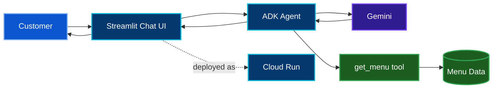

[🏠 Academy Home](../README.md) · [🧭 Overview](../00-academy-overview/) · **☕ Track 1** · [📊 Track 2 →](../02-track-2-gemini-bigquery-mcp/)

# ☕ Track 1 — RAG AI Barista on Cloud Run

## 🎯 What I Am Building

Track 1 focuses on a customer-facing AI Barista that recommends products from a controlled coffee-shop menu. The agent must stay grounded in the available menu, respect product metadata such as allergens, maintain a conversational interface, and run as a deployed Cloud Run service.

**Official codelab:** [Deploy a RAG AI Agent in Streamlit using Google ADK and Cloud Run](https://codelabs.developers.google.com/codelabs/cloud-run/build-streamlit-rag-agent-google-adk-cloud-run)

## 🧩 Problem → Solution

### Problem

A general LLM can produce plausible recommendations that are not connected to the shop's actual products. A menu-driven assistant needs a controlled source of truth and must not invent unavailable items or ignore allergen constraints.

### Solution

The ADK agent connects to a menu tool that supplies the product data used for recommendations. Gemini handles the conversational reasoning, Streamlit provides the chat experience, and Cloud Run hosts the application.

## 🧱 Build Path

| Stage | Engineering purpose |
|---|---|
| Project + API setup | Prepare the Google Cloud services required by the application |
| Menu grounding source | Provide the controlled product data used by the agent |
| ADK agent | Define the model instructions and menu tool behavior |
| Streamlit application | Present the conversation and menu experience |
| Cloud Run identity | Run the service with a dedicated workload identity |
| Cloud Run deployment | Publish the application as a managed service |
| Behavioral validation | Test grounding, unavailable products, allergens, and deployed behavior |

## 🔐 Security Notes

The Cloud Run workload uses a dedicated service account with the model access required by the application rather than relying on a broadly privileged default runtime identity.

The grounding tool also creates an important data boundary: the model can reason about the menu, but the menu remains the source of truth for the product catalog.

## 🧪 Validation Strategy

| Test | What it checks | Expected behavior |
|---|---|---|
| Strong + warm recommendation | Grounded selection | Recommend a suitable item that exists in the menu |
| Out-of-menu request | Hallucination resistance | Decline or redirect instead of inventing a product |
| Lactose-intolerant request | Allergen awareness | Restrict recommendations to options without a dairy conflict |
| Conversation continuity | Session behavior | Preserve the active Streamlit conversation while the session remains alive |
| Cloud Run access | Deployment | Load the working application from the deployed service URL |

[Open the detailed testing matrix](./docs/testing-and-results.md)

## 🧠 What This Track Is Teaching Me

The most important shift for me is that **model quality is not only about fluent answers**. A useful agent needs a source of truth, a controlled tool boundary, a deployable application layer, and tests that challenge the model to stay inside its rules.

The deployment also makes the wider system visible: runtime identity, APIs, environment configuration, build behavior, session state, and Cloud Run all affect whether the agent works reliably.

## 🔎 Detailed Documentation

- [Engineering notes](./docs/engineering-notes.md)
- [Testing & results](./docs/testing-and-results.md)
- [Evidence index](./evidence/README.md)

**Ground the model. Test the boundary. Deploy with intent.**

[🏠 Academy Home](../README.md) · [↑ Track 1 top](#top) · [Track 2 →](../02-track-2-gemini-bigquery-mcp/)

