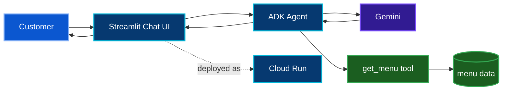

<a id="top"></a>


<div align="center">


[🏠 Academy Home](../README.md) · [🧭 Overview](../00-academy-overview/) · **☕ Track 1** · [📊 Track 2 →](../02-track-2-gemini-bigquery-mcp/)

</div>

# ☕ Track 1 — RAG AI Barista on Cloud Run

## 🎯 What I Am Building

Track 1 is a customer-facing AI agent exercise built around a coffee-shop scenario. The agent should make useful recommendations **without inventing products that are not in the menu**, respect allergen information, maintain a conversational UI, and run as a deployed Cloud Run service.

The official codelab is the implementation source of truth:

**[Deploy a RAG AI Agent in Streamlit using Google ADK and Cloud Run](https://codelabs.developers.google.com/codelabs/cloud-run/build-streamlit-rag-agent-google-adk-cloud-run)**

## 🧩 Problem → Solution

### Problem

A general LLM can produce plausible recommendations that are not connected to the shop's actual products. That is unacceptable for a menu-driven assistant because the response must stay inside a known product catalog and must not ignore allergen constraints.

### Solution

The Track 1 design connects an ADK agent to a controlled menu tool. The model uses that source as grounding context, while Streamlit provides the chat interface and Cloud Run provides the managed deployment target.



## 🧱 Build Path

| Stage | What it establishes | Public status |
|---|---|---|
| Project + API setup | Correct project context and required managed services | ✅ Executed as part of active Track 1 work |
| Menu grounding source | Controlled product data for the agent | 🟡 Source capture pending |
| ADK agent | Tool-backed recommendation logic | 🟡 Source capture pending |
| Streamlit application | Conversation and menu presentation layer | 🟡 Source capture pending |
| Dedicated Cloud Run identity | Runtime identity with focused model-access permissions | 🟡 Evidence curation pending |
| Cloud Run deployment | Public managed service | 🟡 Final proof to be curated |
| RAG behavior tests | In-menu, out-of-menu, and allergen-aware checks | 🟡 Final evidence to be curated |

## 🔐 Security Notes

A useful part of this codelab is that deployment is not treated as "give the app everything and hope for the best." The intended Cloud Run service uses a dedicated service account and the model-access role it needs rather than relying on a broadly privileged default runtime identity.

For the public repository I also keep the following boundaries:

- no credential files or API keys in source control;
- no billing/project-account administration screenshots;
- no unnecessary project numbers or participant-account identifiers;
- no private environment files;

## 🧪 Validation Strategy

The strongest Track 1 tests are behavioral, not cosmetic.

| Test | What it is checking | Expected behavior |
|---|---|---|
| Strong + warm recommendation | Grounded selection | Recommend a suitable item that actually exists in the menu |
| Out-of-menu request | Hallucination resistance | Decline or redirect instead of inventing a product |
| Lactose-intolerant request | Allergen awareness | Restrict recommendations to options without dairy conflict |
| Conversation continuity | Session behavior | Preserve the active browser-session conversation while the session remains alive |
| Cloud Run access | Deployment | App loads successfully from the deployed service URL |

See [`docs/testing-and-results.md`](./docs/testing-and-results.md) for the evidence-ready validation matrix.

## 🧠 What This Track Is Teaching Me

The most important shift for me is that **model quality is not only about fluent answers**. A useful agent needs an explicit source of truth, a controlled tool boundary, a deployable application layer, and tests that challenge the model to stay inside its rules.

A second lesson is operational: the application is more than the prompt. Runtime identity, APIs, environment variables, build behavior, session state, and Cloud Run configuration are all part of the system that makes the agent work.

## 📂 Track 1 Workspace

```text
01-track-1-rag-adk-cloud-run/
├── README.md
├── src/
│   └── README.md                 
├── docs/
│   ├── engineering-notes.md
│   └── testing-and-results.md
└── evidence/
    ├── README.md
    └── images/                   
```

### Why `src/` does not contain reconstructed code yet

The working Track 1 files were created during the hands-on Cloud Shell execution. I want the public repository to preserve **actual implementation provenance**, so the source folder is intentionally waiting for a direct export from the working directory.

That boundary is documented in [`src/README.md`](./src/README.md).

## 🔎 Detailed Documentation

- [Engineering notes](./docs/engineering-notes.md)
- [Testing & results matrix](./docs/testing-and-results.md)
- [Evidence index](./evidence/README.md)
- [Source capture note](./src/README.md)

---

<div align="center">

**Ground the model. Test the boundary. Deploy with intent.**

[🏠 Academy Home](../README.md) · [↑ Track 1 top](#top) · [Track 2 →](../02-track-2-gemini-bigquery-mcp/)

</div>
