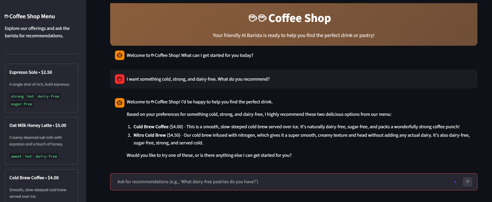
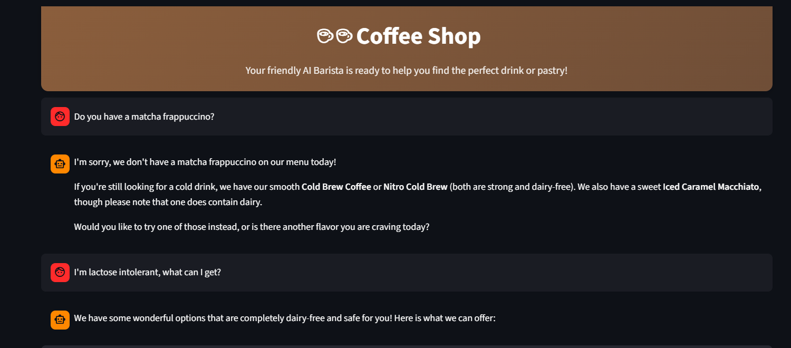
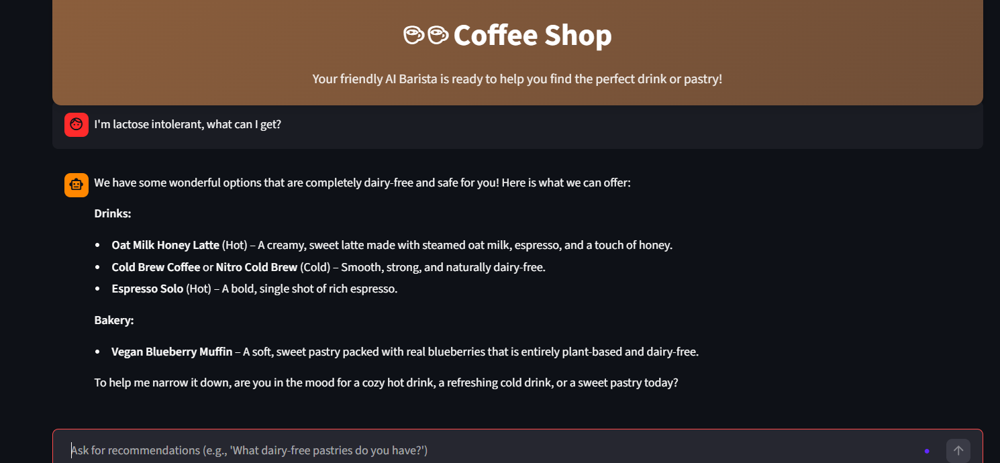
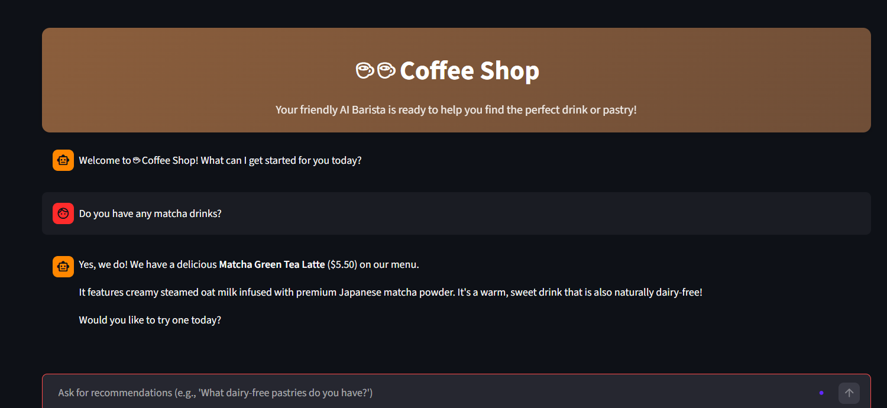

<a id="top"></a>

> 🧭 [Repository Home](../../README.md) › [Track 1](../README.md) › **Testing & Results**

# 🧪 Track 1 Testing & Results

The final Track 1 implementation was validated from the deployed customer interface, including the Firestore Vector Search extension.

## Acceptance matrix

| ID | Test | Expected | Observed | Result | Evidence |
|---|---|---|---|---|---|
| T1-01 | Grounded preference | Recommend real menu items matching cold + strong + dairy-free | Returned **Cold Brew Coffee** and **Nitro Cold Brew** | ✅ PASS | [01](../evidence/images/01-grounded-recommendation.png) |
| T1-02 | Out-of-menu request | Do not invent an unavailable Matcha Frappuccino | The agent did not claim the requested product existed and redirected to real choices | ✅ PASS | [02](../evidence/images/02-out-of-menu-test.png) |
| T1-03 | Dairy constraint | Use recorded menu metadata to avoid dairy-conflicting choices | Returned dairy-free menu options | ✅ PASS | [03](../evidence/images/03-allergen-aware-test.png) |
| T1-04 | Cloud Run deployment | Deployed app loads and produces model-backed responses | Streamlit app loaded successfully from Cloud Run and responded in chat | ✅ PASS | [01](../evidence/images/01-grounded-recommendation.png) |
| T1-05 | Active session conversation | Preserve messages during the active Streamlit session | Multiple user/assistant interactions remained visible during the session | ✅ PASS | [02](../evidence/images/02-out-of-menu-test.png) |
| T1-06 | Firestore vector retrieval | Retrieve semantically relevant menu documents from Firestore | Vector-backed retrieval returned menu data to the agent | ✅ PASS | [04](../evidence/images/04-firestore-vector-search.png) |
| T1-07 | Dynamic database update | New Firestore product appears without changing the seed JSON | **Matcha Green Tea Latte** appeared in the live sidebar | ✅ PASS | [04](../evidence/images/04-firestore-vector-search.png) |
| T1-08 | Dynamic Matcha query | Agent retrieves the new Firestore item for a Matcha request | The agent recommended **Matcha Green Tea Latte** | ✅ PASS | [04](../evidence/images/04-firestore-vector-search.png) |

## Test 1 — Grounded customer preference

**Prompt**

```text
I want something cold, strong, and dairy-free. What do you recommend?
```

**Observed**

The agent recommended **Cold Brew Coffee** and **Nitro Cold Brew**, both valid menu items matching the request.

**Result:** ✅ PASS



## Test 2 — Out-of-menu boundary

**Prompt**

```text
Do you have a matcha frappuccino?
```

**Observed**

The agent did not invent the unavailable product and redirected the conversation to products that existed in the menu.

**Result:** ✅ PASS



## Test 3 — Allergen-aware filtering

**Prompt**

```text
I'm lactose intolerant, what can I get?
```

**Observed**

The response used the menu's recorded dairy metadata to return dairy-free choices and avoid products marked with dairy allergens.

**Result:** ✅ PASS



> [!NOTE]
> This test validates filtering against the catalog metadata. It is not medical guidance, and its accuracy depends on the quality of the product allergen data.

## Test 4 — Firestore Vector Search and live data

The optional Firestore extension changed the application from local-file retrieval to a live vector-backed menu.

A new item, **Matcha Green Tea Latte**, was added directly to Firestore with an embedding. The original `menu.json` remained unchanged.

**Prompt**

```text
Do you have any matcha drinks?
```

**Observed**

The new item appeared in the sidebar and was successfully retrieved by the agent.

**Result:** ✅ PASS



## Final result

**Track 1 technical implementation:** ✅ Complete  
**Core Cloud Run deployment:** ✅ Validated  
**Core RAG tests:** ✅ Passed  
**Firestore Vector Search extension:** ✅ Completed and validated

---

[🧱 Implementation](./implementation.md) · [🧠 Engineering Notes](./engineering-notes.md) · [☕ Track 1](../README.md) · [↑ Back to top](#top)
