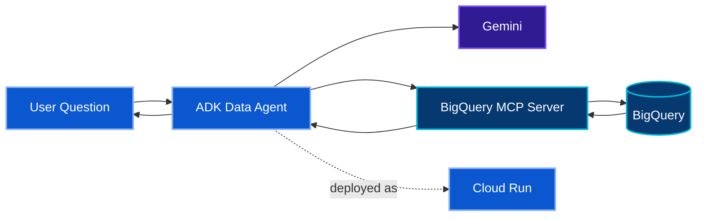

[← ☕ Track 1](../01-track-1-rag-adk-cloud-run/) · [🏠 Academy Home](../README.md) · **📊 Track 2** · [⚙️ Track 3 →](../03-track-3-productivity-agent/)

# 📊 Track 2 — Data Agent with Gemini + BigQuery MCP

**Status: Queued.**

Official codelab: **[Build and Deploy AI Agents with Gemini and BigQuery MCP server in Cloud Run](https://codelabs.developers.google.com/codelabs/cloud-run/cloud-run-adk-gemini-bq-mcp)**

## 🎯 Engineering Mission

Build an ADK data agent that can inspect BigQuery structure, use the managed BigQuery MCP server, formulate read-only SQL, validate assumptions against real schema/data, and deploy the agent to Cloud Run.

The business exercise asks the agent to reason over public Citi Bike data and identify promising locations for a small set of coffee trucks.

## 🏗️ Planned Architecture

## 🔐 Security Lens to Validate During Execution

One design choice already visible in the official codelab is worth preserving: the MCP toolset filters the agent to **read-oriented dataset inspection and read-only SQL execution**. That is a stronger default than giving an analytical agent mutation capability it does not need.

During execution I will specifically document:

- how application credentials are used to reach the managed MCP service;
- which MCP tools the agent can call;
- how read-only SQL limits accidental data modification;
- how the agent verifies schema and values before assuming relationships;
- how the deployed Cloud Run agent is validated against real query results.
 
---

**Inspect the schema. Query the evidence. Let the data constrain the answer.**

[← Track 1](../01-track-1-rag-adk-cloud-run/) · [🏠 Academy Home](../README.md) · [Track 3 →](../03-track-3-productivity-agent/) · [Back to top](#top)

