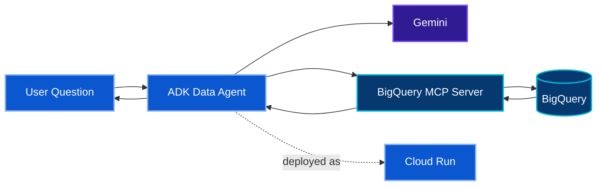

[← ☕ Track 1](../01-track-1-rag-adk-cloud-run/) · [🏠 Academy Home](../README.md) · **📊 Track 2** · [⚙️ Track 3 →](../03-track-3-productivity-agent/)

# 📊 Track 2 — Data Agent with Gemini + BigQuery MCP

**Official codelab:** [Build and Deploy AI Agents with Gemini and BigQuery MCP server in Cloud Run](https://codelabs.developers.google.com/codelabs/cloud-run/cloud-run-adk-gemini-bq-mcp)

## 🎯 Engineering Mission

Build an ADK data agent that can inspect BigQuery structure, use the managed BigQuery MCP server, formulate read-oriented SQL, validate assumptions against real schema and data, and deploy the agent to Cloud Run.

The business exercise uses public Citi Bike data to reason about promising locations for a small set of coffee trucks.

## 🏗️ Target Architecture

## 🔐 Security Focus

- read-oriented dataset inspection and SQL execution;
- authenticated access to the managed BigQuery MCP service;
- clear visibility into the tools exposed to the agent;
- schema and value validation before relying on generated queries;
- Cloud Run workload identity for the deployed agent.

**Inspect the schema. Query the evidence. Let the data constrain the answer.**

[← Track 1](../01-track-1-rag-adk-cloud-run/) · [🏠 Academy Home](../README.md) · [Track 3 →](../03-track-3-productivity-agent/) · [Back to top](#top)

