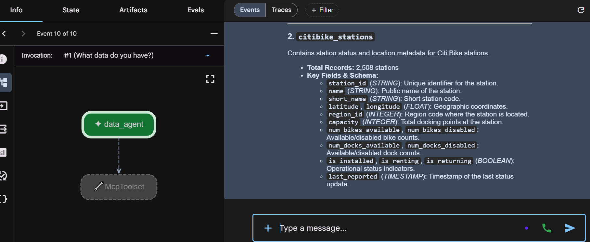
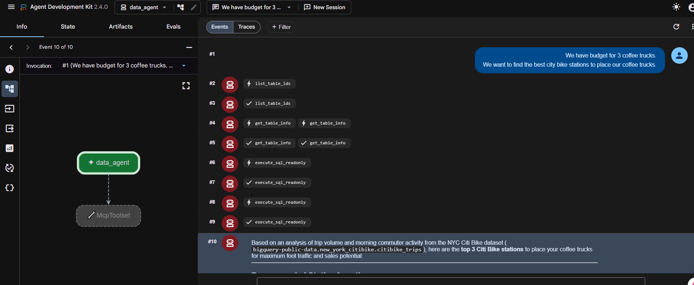
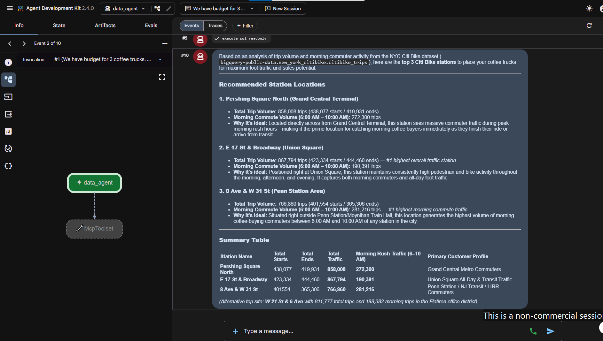
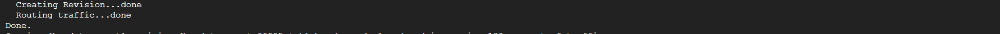

<a id="top"></a>


<div align="center">


[← ☕ Track 1](../01-track-1-rag-adk-cloud-run/) · [🏠 Academy Home](../README.md) · [🧭 Overview](../00-academy-overview/) · **📊 Track 2** · [⚙️ Track 3 →](../03-track-3-productivity-agent/)

</div>


# 📊 Track 2 — BigQuery Data Agent on Cloud Run

## 🎯 What I Built

I built and deployed a **Gemini-powered data agent** that analyzes public NYC Citi Bike data through Google's managed **BigQuery MCP server**.

Instead of asking a user to write SQL, the agent inspects the available tables and schema, runs controlled read-only queries, reasons over the results, and turns the data into a practical recommendation.

The final business task was to identify **three Citi Bike stations where coffee trucks could benefit from high trip volume and morning commuter activity**. The deployed agent completed the analysis and returned three data-backed locations.

**Official codelab:** [Build and Deploy AI Agents with Gemini and BigQuery MCP server in Cloud Run](https://codelabs.developers.google.com/codelabs/cloud-run/cloud-run-adk-gemini-bq-mcp)


## 🧩 Problem → Solution

### Problem

A business question can be simple while the evidence needed to answer it lives inside structured analytical data. A model should not guess table names, assume column types, or invent relationships from prior knowledge.

### Solution

I connected an ADK `LlmAgent` to the managed BigQuery MCP endpoint, authenticated the tool connection with **Application Default Credentials**, exposed a narrow set of inspection and read-only SQL tools, and instructed the agent to inspect the real schema before forming queries.

The agent then used Citi Bike trip data to support the final recommendation instead of producing a generic location answer.


## 🔄 Build Evolution

### Stage 1 — Local data-agent validation

```text
User question
    ↓
Local ADK Web
    ↓
ADK LlmAgent + Gemini
    ↓
McpToolset
    ↓
Managed BigQuery MCP
    ↓
NYC Citi Bike tables + schema
```

The local test answered **"What data do you have?"** by exploring the Citi Bike dataset and surfacing real table/schema information before deployment.

### Stage 2 — Cloud Run deployment and reliability refinement

```text
Deployed ADK Web
      ↓
Cloud Run
      ↓
ADK LlmAgent
      ↓
Gemini + retry/backoff
      ↓
MCP schema / SQL tools
      ↓
BigQuery Citi Bike data
      ↓
Three station recommendations
```

The final deployed version retained the codelab architecture and added two reliability adaptations discovered during troubleshooting: transient HTTP retry/backoff around Gemini and an efficiency rule that stops redundant schema/SQL exploration once enough evidence is available.


## 🏗️ Final Architecture

```mermaid
%%{init: {"themeVariables": {"fontSize": "24px"}, "flowchart": {"nodeSpacing": 45, "rankSpacing": 55}}}%%
flowchart LR

    subgraph ACCESS[" "]
        direction TB
        AH["🌐 USER + CLOUD RUNTIME"]
        U["👤 User"]
        W["🖥️ ADK Web"]
        C["☁️ Cloud Run"]
        U ==> W
        W -.-> C
    end

    subgraph AGENT[" "]
        direction TB
        BH["🧠 AGENT + MODEL"]
        A["🤖 ADK LlmAgent"]
        G["✨ Gemini 3.6 Flash<br/>Retry / Backoff"]
        A <==> G
    end

    subgraph TOOLS[" "]
        direction TB
        CH["🔐 CONTROLLED DATA TOOLS"]
        M["🧰 McpToolset"]
        T["🔎 list_table_ids<br/>get_table_info"]
        Q["📄 execute_sql_readonly"]
        M ==> T
        M ==> Q
    end

    subgraph DATA[" "]
        direction TB
        DH["📊 DATA LAYER"]
        H["🔑 ADC Auth Header"]
        B["🔌 Managed BigQuery MCP"]
        D[("🚲 NYC Citi Bike<br/>BigQuery Dataset")]
        H ==> B
        B <==> D
    end

    W <==> A
    A <==> M
    M <==> H

    classDef header fill:#111827,stroke:#f8fafc,stroke-width:3px,color:#ffffff,font-size:26px;
    classDef user fill:#172554,stroke:#60a5fa,stroke-width:4px,color:#ffffff,font-size:24px;
    classDef app fill:#0c4a6e,stroke:#38bdf8,stroke-width:4px,color:#ffffff,font-size:24px;
    classDef agent fill:#312e81,stroke:#a78bfa,stroke-width:4px,color:#ffffff,font-size:24px;
    classDef model fill:#581c87,stroke:#e879f9,stroke-width:4px,color:#ffffff,font-size:24px;
    classDef tool fill:#134e4a,stroke:#2dd4bf,stroke-width:4px,color:#ffffff,font-size:24px;
    classDef safe fill:#14532d,stroke:#4ade80,stroke-width:4px,color:#ffffff,font-size:24px;
    classDef data fill:#063970,stroke:#00b8d9,stroke-width:4px,color:#ffffff,font-size:24px;

    class AH,BH,CH,DH header;
    class U user;
    class W,C app;
    class A agent;
    class G model;
    class M,T tool;
    class Q,H safe;
    class B,D data;

    style ACCESS fill:#0d1117,stroke:#334155,stroke-width:2px
    style AGENT fill:#0d1117,stroke:#7c3aed,stroke-width:2px
    style TOOLS fill:#0d1117,stroke:#10b981,stroke-width:2px
    style DATA fill:#0d1117,stroke:#0284c7,stroke-width:2px
    linkStyle default stroke:#cbd5e1,stroke-width:4px;
```




## 🧱 Implementation Highlights

| Area | What I implemented |
|---|---|
| **Agent** | ADK `LlmAgent` backed by `gemini-3.6-flash` |
| **Model reliability** | ADK `Gemini(...)` wrapper with exponential retry/backoff for transient 408/429/5xx failures |
| **Data tools** | Managed BigQuery `McpToolset` with dataset/table inspection and `execute_sql_readonly` |
| **Authentication** | Application Default Credentials with refreshable bearer headers and `x-goog-user-project` |
| **Data source** | `bigquery-public-data.new_york_citibike` |
| **Reasoning discipline** | Schema/type inspection before SQL plus explicit no-assumption instructions |
| **Efficiency control** | Reuse schema knowledge and stop repeated SQL/tool loops once enough evidence exists |
| **Local validation** | ADK Web on Cloud Shell Web Preview |
| **Deployment** | ADK Web + data agent deployed as `bq-data-agent` on Cloud Run |

### Source files

```text
source/
├── data_agent/
│   ├── __init__.py
│   ├── agent.py
│   └── requirements.txt
├── env.sh.example
└── scripts/
    ├── 01-setup-track2.sh
    ├── 02-run-local-adk-web.sh
    ├── 03-deploy-cloud-run.sh
    ├── 04-get-service-url.sh
    └── 05-read-cloud-run-logs.sh
```

[Open the implementation guide](./docs/implementation.md)


## 🔐 Security & Data-Access Model

| Control | Implementation |
|---|---|
| **Credential handling** | The agent uses Google Cloud Application Default Credentials; no API key or service-account JSON is embedded in the source |
| **Credential refresh** | The auth header provider refreshes ADC when needed before calling the managed MCP endpoint |
| **Project attribution** | `x-goog-user-project` is supplied with the authenticated MCP request |
| **Tool boundary** | The agent receives a small BigQuery toolset rather than unrestricted database operations |
| **SQL boundary** | Analysis is performed through `execute_sql_readonly` |
| **Schema verification** | The system instruction requires inspection of table structure, types, and values before relying on generated SQL |

The codelab deployment uses an unauthenticated ADK Web endpoint for the exercise, so I treat that as a lab deployment choice rather than an end-user access-control design.


## 🧪 Testing & Results

| Test | Observed result | Status |
|---|---|---|
| Python/package validation | Final agent package compiled successfully | ✅ PASS |
| Local ADK Web | `data_agent` launched and responded through Web Preview | ✅ PASS |
| BigQuery discovery | Agent inspected Citi Bike tables and schema | ✅ PASS |
| MCP execution | `list_table_ids`, `get_table_info`, and `execute_sql_readonly` appeared in the trace | ✅ PASS |
| Read-only analysis | SQL executed through the managed BigQuery MCP toolset | ✅ PASS |
| Cloud Run deployment | Final revision deployed and served 100% of traffic | ✅ PASS |
| Gemini global location | Final deployment used the required global Gemini location | ✅ PASS |
| Final business task | Agent returned three data-backed Citi Bike station recommendations | ✅ PASS |

[Open the full test record](./docs/testing-and-results.md)


## 🛠️ Troubleshooting Journey

The hardest part of Track 2 was that several failures appeared through the same deployed ADK Web experience even though they came from different layers.

The debugging path moved through:

**model location 404 → generic ADK Web network symptom → MCP trace verification → Vertex AI 429 → direct non-SSE diagnostic → retry/backoff + shorter tool loop → successful deployed result**

The turning point was reading the event trace and Cloud Run logs instead of treating every browser error as an MCP failure. The logs showed successful BigQuery MCP calls, which narrowed the investigation to the model/streaming path. A direct `/run` test then reproduced the 429 outside the browser SSE flow, proving the UI was not the only source of failure.

[Open the complete troubleshooting case study](./docs/troubleshooting.md)


## 🧾 Evidence Highlights

<table>
<tr>
<td width="50%" valign="top">
<h3>Local BigQuery MCP exploration</h3>

<p>The local agent inspected the Citi Bike station table and surfaced real schema fields before deployment.</p>
</td>
<td width="50%" valign="top">
<h3>MCP tool trace</h3>

<p>The deployed trace shows table inspection and read-only SQL tool calls for the coffee-truck question.</p>
</td>
</tr>
<tr>
<td width="50%" valign="top">
<h3>Final deployed recommendation</h3>

<p>The completed deployed run returned three Citi Bike locations backed by trip-volume and morning-commute analysis.</p>
</td>
<td width="50%" valign="top">
<h3>Cloud Run deployment</h3>

<p>The final Cloud Run revision deployed successfully and served 100% of traffic.</p>
</td>
</tr>
</table>

[Open the evidence index](./evidence/README.md)


## 🧠 What I Learned

Track 2 made the boundary between **model reasoning and tool authority** much clearer to me. Gemini did not already know the Citi Bike schema; the trace showed the agent explicitly calling MCP tools to inspect the data and execute read-only SQL.

I also understood ADC more practically. The application could authenticate to a managed Google Cloud tool without putting a key in the Python source, while the model reasoning and data-access permissions remained separate concerns.

The troubleshooting was the strongest learning part. A browser `network error` looked like a connectivity problem, but the tool trace showed MCP was working. Reading the backend logs, comparing the streaming response with later internal calls, and testing the non-SSE `/run` path taught me to diagnose the failing layer instead of repeatedly changing the whole deployment.

The final successful trace was especially satisfying because it showed that reliability is not only about retrying an API. The agent also needed to stop rediscovering the same schema and issuing unnecessary tool/model rounds after it already had enough evidence.

[Read the engineering notes](./docs/engineering-notes.md)


## ⚠️ Limitations

- ADK Web is a development/debug interface rather than a polished end-user analytics product.
- The codelab deployment is unauthenticated for the exercise.
- Citi Bike trip activity is only one signal for coffee-truck placement; the analysis does not include rent, permits, competition, weather, or full pedestrian-demand data.
- Retry/backoff reduces the impact of transient model failures but does not guarantee capacity under every traffic condition.
- The efficiency rule was tuned for this exercise and would need broader evaluation for a general-purpose data agent.

## 🔭 Possible Security & Engineering Enhancements

- require authenticated Cloud Run access for a non-demo deployment;
- run the service under a reviewed least-privilege runtime identity;
- add structured metrics for model retries, MCP tool count, latency, and failures;
- cache stable schema metadata to reduce repeated discovery work;
- build automated evaluations for SQL correctness and recommendation consistency;
- add cost and query guardrails for model and BigQuery usage;
- replace ADK Web with a purpose-built user interface for a business-facing product.


## 🔎 Technical Documentation

| Document | Focus |
|---|---|
| [Implementation](./docs/implementation.md) | Environment, APIs, source, local test, deployment, and reusable commands |
| [Engineering Notes](./docs/engineering-notes.md) | Practical learning from ADK, MCP, ADC, data reasoning, and reliability work |
| [Testing & Results](./docs/testing-and-results.md) | Expected versus observed validation record |
| [Troubleshooting](./docs/troubleshooting.md) | 404 → network symptom → 429 diagnosis → final stabilization |
| [Evidence Index](./evidence/README.md) | Curated success and troubleshooting evidence |


<div align="center">

**Inspect the schema. Trace the tools. Diagnose the layer. Let the data support the decision.**

[← Track 1](../01-track-1-rag-adk-cloud-run/) · [🏠 Academy Home](../README.md) · [↑ Track 2 top](#top) · [Track 3 →](../03-track-3-productivity-agent/)

</div>
