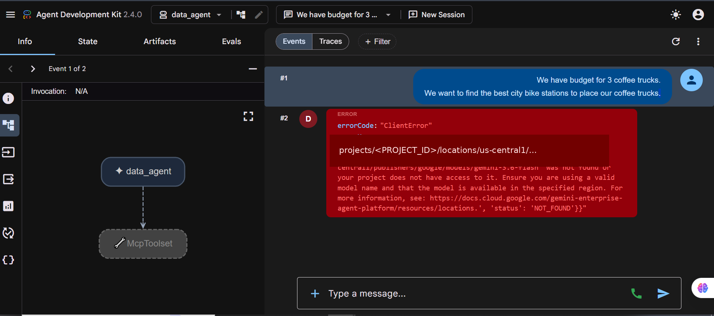
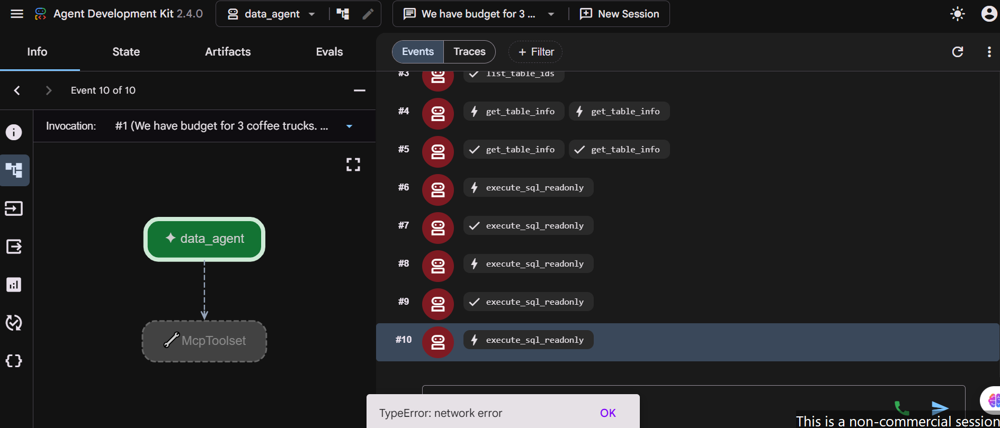
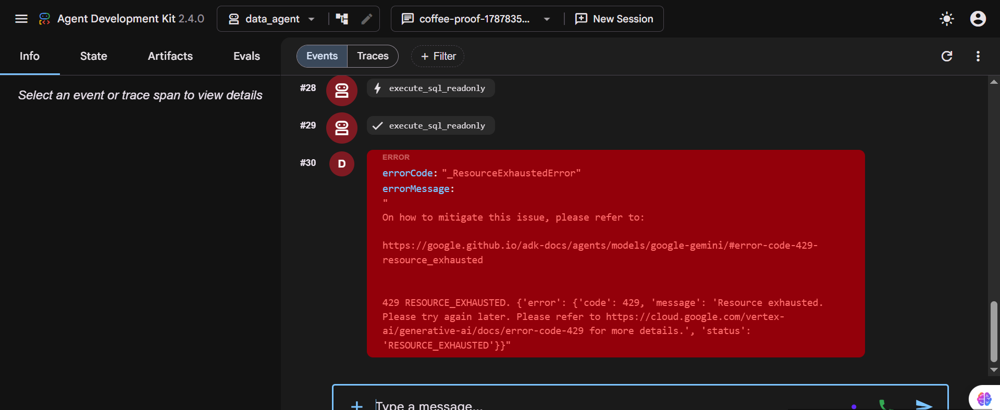

<a id="top"></a>

> 🧭 [Repository Home](../../README.md) › [Track 2](../README.md) › **Troubleshooting**

# 🛠️ Track 2 Troubleshooting — Diagnosing the Layer

Track 2 was not a straight-line deployment. Several failures appeared in the deployed ADK Web interface, but they came from different parts of the system.

The useful lesson was to stop treating every visible error as the same problem and isolate the failure using **tool traces, Cloud Run logs, direct endpoint tests, and controlled source changes**.

## Issue 1 — Deployed Gemini model location returned 404

**Symptom**  
The first Cloud Run deployment completed, but the deployed agent returned `404 NOT_FOUND` when it tried to use `gemini-3.6-flash` in `us-central1`.

**Evidence**



**Root cause**  
The local session had `GOOGLE_CLOUD_LOCATION=global`, but the first Cloud Run deployment did not pass the required Gemini environment variables into the deployed revision.

**Fix**  
Redeploy the same service with:

```text
GOOGLE_GENAI_USE_ENTERPRISE=True
GOOGLE_CLOUD_PROJECT=<PROJECT_ID>
GOOGLE_CLOUD_LOCATION=global
```

**Verification**  
Later Cloud Run logs showed successful Gemini requests through the global location.

**Lesson**  
The Cloud Run compute region and the model API location are separate configuration choices. A deployment can be healthy while the model request is pointed at the wrong location.

## Issue 2 — `TypeError: network error` looked like MCP failure

**Symptom**  
ADK Web displayed a generic browser-side `TypeError: network error` during the deployed coffee-truck run.

**Evidence**



**Diagnosis**  
The event trace showed successful `get_table_info` and `execute_sql_readonly` calls. Cloud Run logs also showed successful HTTP responses from the BigQuery MCP endpoint.

That ruled out the idea that the agent simply could not reach MCP.

**Verification**  
The trace itself remained the stronger signal: MCP tool calls had executed even though the browser later showed a network toast.

**Lesson**  
A frontend error can be a secondary symptom. Tool traces and backend logs are more useful than the browser message when diagnosing a multi-step agent run.

## Issue 3 — A later Gemini call returned `429 RESOURCE_EXHAUSTED`

**Symptom**  
The deployed run progressed through many Gemini and BigQuery MCP calls, then failed with `429 RESOURCE_EXHAUSTED`.

**Evidence**



**Root cause observed during execution**  
One business question caused a long chain of repeated model/tool rounds: inspect schema, reason, run SQL, reason again, and continue exploring. Earlier calls succeeded before a later Gemini request hit transient resource exhaustion.

**Important observation**  
`POST /run_sse` returning HTTP 200 did not prove the whole invocation finished. The streaming response had opened successfully before the later internal model call failed.

**Lesson**  
For streamed agent workloads, successful request headers and a successful full invocation are not the same thing.

## Diagnostic step — Direct non-SSE `/run`

To separate browser streaming from backend model behavior, I created a fresh session and called the deployed `/run` endpoint directly.

The non-SSE request also returned the 429.

**What this proved**  
The ADK Web streaming layer was not the only source of the failure. The remaining issue could be reproduced directly in the deployed backend execution path.

## Final stabilization

I kept the same core architecture and made two focused changes.

### 1. Add retry/backoff at the Gemini model layer

```python
model=Gemini(
    model="gemini-3.6-flash",
    retry_options=types.HttpRetryOptions(
        attempts=8,
        initial_delay=2.0,
        max_delay=30.0,
        exp_base=2.0,
        jitter=1.0,
        http_status_codes=[408, 429, 500, 502, 503, 504],
    ),
)
```

An earlier retry adjustment did not resolve the problem. The final working configuration applies retry handling at the ADK `Gemini(...)` model layer.

### 2. Reduce redundant tool/model rounds

The final instruction added an efficiency rule:

- reuse schema information already discovered;
- do not repeatedly inspect the same table;
- focus on the relevant Citi Bike tables;
- limit unnecessary read-only SQL calls after the schema is understood;
- stop calling tools once enough evidence exists to choose three stations.

## Final verification

The next successful deployed run used the BigQuery MCP toolset and completed the coffee-truck task.


It recommended:

1. **Pershing Square North (Grand Central Terminal)**
2. **E 17 St & Broadway (Union Square)**
3. **8 Ave & W 31 St (Penn Station Area)**

The final trace also visibly included `list_table_ids`, `get_table_info`, and `execute_sql_readonly`.

## Troubleshooting timeline

```text
Cloud Run deployment
      ↓
404 model-location failure
      ↓
Pass Gemini location as global
      ↓
ADK Web network error
      ↓
Trace proves MCP calls succeeded
      ↓
Cloud Run logs expose later 429
      ↓
Direct /run reproduces 429
      ↓
Correct Gemini retry/backoff
      +
Reduce redundant tool loops
      ↓
Redeploy
      ↓
Successful 3-station answer
```

## What I carried forward

The repeated failures were frustrating, but the useful part was learning to **diagnose by layer** instead of repeatedly rebuilding the same system.

I ended up separating:

- Cloud Run deployment health;
- Gemini model location;
- BigQuery MCP connectivity;
- ADK Web SSE behavior;
- transient model capacity;
- agent tool-loop efficiency.

That debugging process gave me a much better understanding of the deployed agent than a clean first attempt would have.

### Deep evidence

- [Sanitized diagnostic excerpt](../evidence/logs/diagnostic-logs-sanitized.txt)
- [Sanitized successful runtime excerpt](../evidence/logs/runtime-success-sanitized.txt)

---

[🧱 Implementation](./implementation.md) · [🧠 Engineering Notes](./engineering-notes.md) · [🧪 Testing & Results](./testing-and-results.md) · [📊 Track 2](../README.md) · [↑ Back to top](#top)
