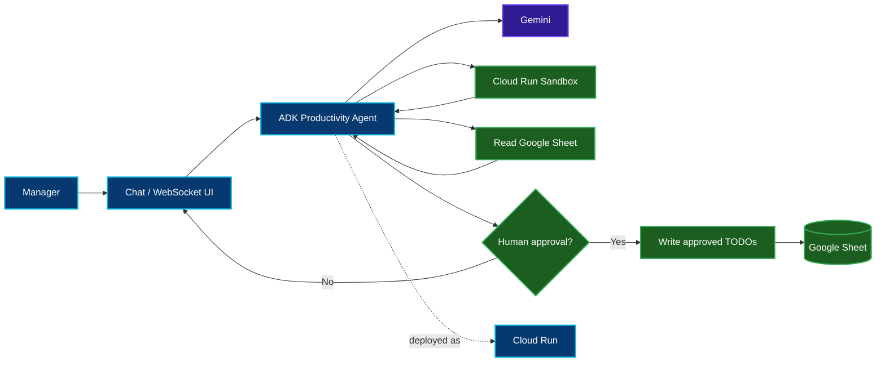

[← 📊 Track 2](../02-track-2-gemini-bigquery-mcp/) · [🏠 Academy Home](../README.md) · **⚙️ Track 3**

# ⚙️ Track 3 — Personal Productivity Agent on Cloud Run

**Status: Queued.** The workspace stays intentionally lean until the official Track 3 execution begins.

Official codelab: **[Run a personal agent on a Cloud Run service](https://codelabs.developers.google.com/codelabs/cloud-run/cloud-run-personal-agent-coffee-shop)**

## 🎯 Engineering Mission

Build a personal AI assistant for a coffee-shop manager preparing for a high-demand weekend. The agent must analyze operational data, execute code inside a sandboxed environment, generate staffing/inventory recommendations, and **wait for explicit permission before writing operational TODOs back to the spreadsheet**.

## 🏗️ Planned Architecture

## 🔐 Security / Control Questions I Will Validate

Track 3 is especially interesting from a DevSecOps perspective because the agent crosses from **analysis** into **action**.

I will document:

- the dedicated Cloud Run service identity;
- spreadsheet access granted to the service identity rather than a key file;
- the boundary between local execution and the production Cloud Run sandbox;
- the point where the agent asks for human approval;
- whether a write action can occur without that approval;
- how WebSocket interaction and operational errors are surfaced to the user.

## 🧾 Documentation State

The source, testing record and evidence are not populated yet. They will be added from the actual execution rather than from the plan.

---

**Analyze safely. Ask before acting. Verify the operational change.**

[← Track 2](../02-track-2-gemini-bigquery-mcp/) · [🏠 Academy Home](../README.md) · [Back to top](#top)

