[← 📊 Track 2](../02-track-2-gemini-bigquery-mcp/) · [🏠 Academy Home](../README.md) · **⚙️ Track 3**

# ⚙️ Track 3 — Personal Productivity Agent on Cloud Run

**Official codelab:** [Run a personal agent on a Cloud Run service](https://codelabs.developers.google.com/codelabs/cloud-run/cloud-run-personal-agent-coffee-shop)

## 🎯 Engineering Mission

Build a personal AI assistant for a coffee-shop manager preparing for a high-demand weekend. The agent analyzes operational data, executes code inside a sandboxed environment, generates staffing and inventory recommendations, and waits for explicit approval before writing operational TODOs back to the spreadsheet.

## 🏗️ Target Architecture

```mermaid
%%{init: {"theme":"base","themeVariables":{"fontSize":"24px"},"flowchart":{"nodeSpacing":50,"rankSpacing":60,"curve":"basis"}}}%%

flowchart LR

    %% =====================================================
    %% 1 — USER ACCESS
    %% =====================================================
    subgraph S1[" "]
        direction TB

        H1["🌐 1 · USER ACCESS"]

        U["👤 Manager"]
        W["🖥️ Chat / WebSocket UI"]

        H1 ==> U ==> W
    end


    %% =====================================================
    %% 2 — AGENT RUNTIME
    %% =====================================================
    subgraph S2[" "]
        direction TB

        H2["🤖 2 · AGENT RUNTIME"]

        A["🧠 ADK Productivity Agent"]
        C["☁️ Cloud Run<br/>Deployment"]

        H2 ==> A
        A -.-> C
    end


    %% =====================================================
    %% 3 — CONNECTED SERVICES
    %% =====================================================
    subgraph S3[" "]
        direction TB

        H3["🔗 3 · CONNECTED SERVICES"]

        G["✨ Gemini"]
        S["🛡️ Cloud Run Sandbox"]
        R["📄 Read Google Sheet"]

        H3 ==> G
        H3 ==> S
        H3 ==> R
    end


    %% =====================================================
    %% 4 — APPROVAL + OUTPUT
    %% =====================================================
    subgraph S4[" "]
        direction TB

        H4["✅ 4 · APPROVAL + OUTPUT"]

        H["⚖️ Human Approval"]
        X["📝 Write Approved TODOs"]
        D[("📗 Google Sheet")]
        N["↩️ Not Approved<br/>Return to UI"]

        H4 ==> H
        H --> X
        X --> D
        H --> N
    end


    %% =====================================================
    %% MAIN FLOW
    %% =====================================================
    W ==> A

    A ==> G
    A ==> S
    A ==> R

    S ==> A
    R ==> A

    A ==> H
    N -.-> W


    %% =====================================================
    %% PREMIUM STYLES
    %% =====================================================
    classDef header fill:#111827,stroke:#f8fafc,stroke-width:4px,color:#ffffff,font-size:26px;
    classDef user fill:#172554,stroke:#60a5fa,stroke-width:4px,color:#ffffff,font-size:24px;
    classDef ui fill:#0c4a6e,stroke:#38bdf8,stroke-width:4px,color:#ffffff,font-size:24px;

    classDef agent fill:#312e81,stroke:#a78bfa,stroke-width:4px,color:#ffffff,font-size:24px;
    classDef runtime fill:#1e3a8a,stroke:#60a5fa,stroke-width:4px,color:#ffffff,font-size:24px;

    classDef model fill:#581c87,stroke:#e879f9,stroke-width:4px,color:#ffffff,font-size:24px;
    classDef safe fill:#14532d,stroke:#4ade80,stroke-width:4px,color:#ffffff,font-size:24px;
    classDef read fill:#166534,stroke:#22c55e,stroke-width:4px,color:#ffffff,font-size:24px;

    classDef approval fill:#713f12,stroke:#fbbf24,stroke-width:4px,color:#ffffff,font-size:24px;
    classDef write fill:#7c2d12,stroke:#fb923c,stroke-width:4px,color:#ffffff,font-size:24px;
    classDef sheet fill:#14532d,stroke:#4ade80,stroke-width:4px,color:#ffffff,font-size:24px;
    classDef reject fill:#3f3f46,stroke:#cbd5e1,stroke-width:4px,color:#ffffff,font-size:24px;

    class H1,H2,H3,H4 header;

    class U user;
    class W ui;

    class A agent;
    class C runtime;

    class G model;
    class S safe;
    class R read;

    class H approval;
    class X write;
    class D sheet;
    class N reject;


    %% =====================================================
    %% CONTAINER STYLES
    %% =====================================================
    style S1 fill:#0d1117,stroke:#334155,stroke-width:2px
    style S2 fill:#0d1117,stroke:#7c3aed,stroke-width:2px
    style S3 fill:#0d1117,stroke:#22c55e,stroke-width:2px
    style S4 fill:#0d1117,stroke:#f59e0b,stroke-width:2px


    %% =====================================================
    %% CONNECTORS
    %% =====================================================
    linkStyle default stroke:#dbe4ee,stroke-width:5px;
```

## 🔐 Security & Control Model

- dedicated Cloud Run service identity;
- spreadsheet access through the workload identity rather than a downloaded key file;
- sandboxed code execution;
- explicit human approval before operational write actions;
- clear separation between analysis and mutation;
- visible handling of WebSocket and operational errors.

**Analyze safely. Ask before acting. Verify the operational change.**

[← Track 2](../02-track-2-gemini-bigquery-mcp/) · [🏠 Academy Home](../README.md) · [Back to top](#top)

