<a id="top"></a>


<div align="center">


[← ☕ Track 1](../01-track-1-rag-adk-cloud-run/) · [← 📊 Track 2](../02-track-2-gemini-bigquery-mcp/) · [🏠 Academy Home](../README.md) · [🧭 Overview](../00-academy-overview/) · **⚙️ Track 3**

</div>


# ⚙️ Track 3 — Coffee Shop Productivity Agent on Cloud Run

## 🎯 What I Built

I built and deployed a **coffee-shop productivity agent** that reads historical Point-of-Sale data from Google Sheets, analyzes operational patterns with Gemini and sandboxed Python/shell execution, recommends staffing and inventory actions, and waits for explicit human approval before writing approved tasks back to the Sheet.

The application combines **Google ADK, FastAPI, WebSockets, Google Sheets, Cloud Run Sandbox, Vertex AI, and Cloud Run** in one interactive workflow.

The final test used the 2026 university graduation schedule together with historical `POS-2025` data. The agent identified likely demand spikes and staffing bottlenecks, proposed a short TODO list, asked permission to write it, and updated `TODO-2026` only after I replied **Yes**.

**Official codelab:** [Run a personal agent on a Cloud Run service](https://codelabs.developers.google.com/codelabs/cloud-run/cloud-run-personal-agent-coffee-shop)


## 🧩 Problem → Solution

### Problem

A manager can ask for operational advice in natural language, but a useful productivity agent needs more than a plausible response. It must read the real historical data, perform the analysis, separate recommendations from write actions, and avoid changing operational records before the manager agrees.

### Solution

I built an ADK `LlmAgent` with four controlled tools:

- `read_spreadsheet_values` for historical and operational Sheet data;
- `execute_sandbox_command` for Python/shell analysis;
- `create_spreadsheet_tab` for the approved TODO destination;
- `update_spreadsheet_values` for the final approved write.

The browser UI communicates with the agent through a FastAPI WebSocket. In the deployed service, analysis commands run through the **Cloud Run Sandbox** launcher. The agent first reads and analyzes `POS-2025`, returns staffing/inventory recommendations, explicitly asks whether to update `TODO-2026`, and performs the Sheet write only after approval.


## 🔄 How the Build Evolved

### Stage 1 — Operational data + interactive agent

```text
Manager
   ↓
FastAPI / WebSocket UI
   ↓
ADK LlmAgent + Gemini
   ↓
Google Sheets tools
   ↓
POS-2025 historical data
```

The first layer connected the deployed agent to the historical POS Sheet and made the analysis accessible through a continuous browser conversation.

### Stage 2 — Sandboxed analysis

```text
Historical POS rows
      ↓
ADK tool call
      ↓
execute_sandbox_command
      ↓
Cloud Run Sandbox
      ↓
Python / shell analysis
      ↓
Demand + wait-time findings
```

The same tool uses a local fallback when the sandbox launcher is unavailable during development, while the deployed Cloud Run revision routes commands through `/usr/local/gcp/bin/sandbox`.

### Stage 3 — Human-approved operational action

```text
Data-backed recommendation
        ↓
Ask manager for approval
        ↓
      "Yes"
        ↓
Create / update TODO-2026
        ↓
Write approved tasks
```

This final stage changed the project from an analytical assistant into a controlled operational agent.


## 🏗️ Final Architecture

```mermaid
%%{init: {"themeVariables": {"fontSize": "22px"}, "flowchart": {"nodeSpacing": 42, "rankSpacing": 52}}}%%
flowchart LR

    subgraph ACCESS[" "]
        direction TB
        AH["🌐 USER EXPERIENCE"]
        U["👤 Coffee Shop Manager"]
        UI["☕ FastAPI Chat UI<br/>WebSocket /ws"]
        U ==> UI
    end

    subgraph AGENT[" "]
        direction TB
        BH["🤖 AGENT RUNTIME"]
        CR["☁️ Cloud Run"]
        A["🧠 Google ADK LlmAgent"]
        G["✨ Gemini / Vertex AI"]
        CR ==> A
        A <==> G
    end

    subgraph TOOLS[" "]
        direction TB
        CH["🧰 CONTROLLED TOOLS"]
        R["📖 Read Sheet"]
        S["🛡️ Sandbox Command"]
        W["📝 Create / Update Sheet"]
    end

    subgraph DATA[" "]
        direction TB
        DH["📊 OPERATIONAL DATA"]
        P[("POS-2025")]
        T[("TODO-2026")]
        SB["📦 Cloud Run Sandbox<br/>Python + shell"]
    end

    subgraph APPROVAL[" "]
        direction TB
        EH["⚖️ ACTION BOUNDARY"]
        REC["💡 Recommendations"]
        H["✅ Explicit Human Approval"]
        REC ==> H
    end

    UI <==> A
    A ==> R
    A ==> S
    R <==> P
    S <==> SB
    A ==> REC
    H ==> W
    W ==> T

    classDef header fill:#111827,stroke:#f8fafc,stroke-width:3px,color:#ffffff,font-size:24px;
    classDef user fill:#172554,stroke:#60a5fa,stroke-width:4px,color:#ffffff,font-size:22px;
    classDef app fill:#0c4a6e,stroke:#38bdf8,stroke-width:4px,color:#ffffff,font-size:22px;
    classDef agent fill:#312e81,stroke:#a78bfa,stroke-width:4px,color:#ffffff,font-size:22px;
    classDef model fill:#581c87,stroke:#e879f9,stroke-width:4px,color:#ffffff,font-size:22px;
    classDef safe fill:#14532d,stroke:#4ade80,stroke-width:4px,color:#ffffff,font-size:22px;
    classDef data fill:#063970,stroke:#00b8d9,stroke-width:4px,color:#ffffff,font-size:22px;
    classDef approval fill:#713f12,stroke:#fbbf24,stroke-width:4px,color:#ffffff,font-size:22px;

    class AH,BH,CH,DH,EH header;
    class U user;
    class UI,CR app;
    class A agent;
    class G model;
    class R,S,W,SB safe;
    class P,T data;
    class REC,H approval;

    style ACCESS fill:#0d1117,stroke:#334155,stroke-width:2px
    style AGENT fill:#0d1117,stroke:#7c3aed,stroke-width:2px
    style TOOLS fill:#0d1117,stroke:#22c55e,stroke-width:2px
    style DATA fill:#0d1117,stroke:#0284c7,stroke-width:2px
    style APPROVAL fill:#0d1117,stroke:#f59e0b,stroke-width:2px
    linkStyle default stroke:#dbe4ee,stroke-width:4px;
```




## 🧱 Implementation Highlights

| Area | What I implemented |
|---|---|
| **Agent** | Google ADK `LlmAgent` with Gemini through Vertex AI |
| **Web application** | FastAPI service with browser UI and persistent WebSocket chat |
| **Session handling** | ADK `Runner` with `InMemorySessionService` |
| **Historical data** | Google Sheet tab `POS-2025` |
| **Operational output** | Google Sheet tab `TODO-2026` |
| **Sheet tools** | Read, create-tab, and update operations through the Google Sheets API |
| **Analysis tool** | Shell/Python execution through a Cloud Run Sandbox-compatible tool |
| **Production execution** | `/usr/local/gcp/bin/sandbox` when running in the sandbox-enabled Cloud Run revision |
| **Local fallback** | Direct local command execution when the sandbox launcher is not present |
| **Workload identity** | Dedicated `coffee-shop-agent-sa` service account |
| **Container** | Python 3.11, Uvicorn, and Dockerfile-based Cloud Run build |
| **Human control** | Recommendation first; operational write only after explicit approval |

### Source and data

```text
source/
├── main.py
├── requirements.txt
├── Dockerfile
├── .env.example
└── scripts/
    ├── 01-preflight.sh
    ├── 02-service-account-iam.sh
    ├── 03-validate-app.sh
    ├── 04-deploy.sh
    ├── 05-runtime-diagnostics.sh
    └── 06-refresh-spreadsheet-id.sh

data/
├── POS-2025.csv
└── graduation-schedule-prompt.txt
```

[Open the implementation guide](./docs/implementation.md)


## ⚖️ Human Approval Before Operational Change

The most important Track 3 behavior is the separation between **analysis** and **mutation**.

The agent first returned data-backed recommendations and ended by asking:

> Would you like me to add these tasks to your `TODO-2026` TODO list?

At that point the recommendations were visible, but the operational Sheet had not yet been changed.

Only after I replied **Yes** did the agent create/update `TODO-2026` and confirm the written staffing and inventory tasks.

<table>
<tr>
<td width="50%" valign="top">
<strong>Before approval</strong><br/><br/>

<br/><em>The agent finished the analysis and stopped at the approval question.</em>
</td>
<td width="50%" valign="top">
<strong>After approval</strong><br/><br/>

<br/><em>After explicit approval, the agent confirmed the approved tasks written to <code>TODO-2026</code>.</em>
</td>
</tr>
</table>


## 🔐 Security & Control Model

| Control | Implementation |
|---|---|
| **Dedicated workload identity** | Cloud Run uses `coffee-shop-agent-sa` rather than embedding credentials in the application |
| **Model access** | The runtime identity receives Vertex AI access for the agent workflow |
| **Local impersonation** | Service Account Token Creator permission supports local/test impersonation without a downloaded key file |
| **Sheet access** | The operational Sheet is shared directly with the workload identity |
| **Private runtime configuration** | `SPREADSHEET_ID` is supplied at runtime and is not committed |
| **Sandbox boundary** | Production shell/Python execution is routed through Cloud Run Sandbox |
| **Tool separation** | Sheet reading, tab creation, and value updates are separate tools |
| **Human approval** | The agent instruction requires explicit approval before operational write actions |

The captured workflow proves that the approval instruction was followed during the final run. In a stronger production design, I would also enforce that gate deterministically in application/tool authorization logic rather than relying on prompt compliance alone.


## 🧪 Testing & Results

| Validation | Observed result | Status |
|---|---|---|
| Python source validation | `main.py` compiled successfully | ✅ PASS |
| Application structure | Sandbox, Sheet tools, HTTP route, and WebSocket route were present | ✅ PASS |
| Cloud Run deployment | Final revision deployed and served 100% of traffic | ✅ PASS |
| WebSocket interaction | Browser connected and received agent responses | ✅ PASS |
| Production sandbox | Deployed runtime launched the Cloud Run Sandbox path | ✅ PASS |
| Runtime identity | Cloud Run used the dedicated coffee-shop service account | ✅ PASS |
| Historical POS read | Deployed raw tool call returned real `POS-2025` rows after the data fix | ✅ PASS |
| Data-backed analysis | Final recommendations used historical POS demand and wait-time patterns | ✅ PASS |
| Approval boundary | Agent asked for explicit permission before writing | ✅ PASS |
| Approved write | `Yes` triggered the `TODO-2026` create/update path | ✅ PASS |
| Operational evidence | Approved staffing/inventory rows were visible in Google Sheets | ✅ PASS |

[Open the full testing record](./docs/testing-and-results.md)


## 🛠️ Troubleshooting Journey

The first deployed end-to-end test produced a user-facing message that suggested the agent could not access `POS-2025` correctly.

The interface itself was healthy. Cloud Run started normally, the WebSocket was connected, and the production sandbox launched. I kept moving down the data path instead of changing those working layers.

A direct deployed `/chat` diagnostic finally exposed the decisive backend result:

```text
No data found in the specified range.
```

After the official historical POS data was populated in `POS-2025`, the same raw tool check returned real rows. The full browser workflow then completed successfully.

> **The interface was healthy; the data path was not.**

[Open the full troubleshooting journey](./docs/troubleshooting.md)


## 🧾 Evidence Highlights

<table>
<tr>
<td width="50%" valign="top">
<strong>Approval boundary</strong><br/><br/>

<br/><em>Recommendations were presented before the operational write.</em>
</td>
<td width="50%" valign="top">
<strong>Approved action</strong><br/><br/>

<br/><em>The agent confirmed the write only after explicit approval.</em>
</td>
</tr>
<tr>
<td width="50%" valign="top">
<strong>TODO-2026 output</strong><br/><br/>

<br/><em>The approved staffing and inventory actions are visible in the operational Sheet.</em>
</td>
<td width="50%" valign="top">
<strong>Cloud Run deployment</strong><br/><br/>

<br/><em>The final revision deployed successfully and served 100% of traffic.</em>
</td>
</tr>
</table>

[Open the evidence index](./evidence/README.md)


## 🧠 What I Learned

Track 3 changed how I thought about AI agents because the agent was no longer only generating an answer. It could read operational data, run analysis, and eventually change the business Sheet. That made the control boundary much more concrete.

I especially enjoyed seeing the FastAPI and WebSocket pieces turn the agent into a continuously interactive application instead of a one-request demo. The sandbox was also interesting because the same analysis tool could use a local execution fallback during development and the Cloud Run Sandbox in the deployed environment.

The troubleshooting reinforced a lesson from Track 2: the message shown in the UI is not automatically the root cause. The logs showed that the service, WebSocket, sandbox, and runtime identity were healthy, so I kept isolating the data path until the raw Sheets response exposed the missing historical data.

The final approval flow was the most important part for me. As the agent moved from **reading** and **reasoning** to **writing**, the need for an explicit control point became much clearer.

[Open the engineering notes](./docs/engineering-notes.md)


## ⚠️ Limitations

- The codelab deploys the interactive service with unauthenticated access; that is suitable for the lab workflow, not a complete end-user access-control design.
- `InMemorySessionService` and the fixed demo session identifiers are appropriate for this single-user exercise, not persistent multi-user session management.
- The human approval boundary is enforced primarily through the agent instruction rather than a deterministic application authorization state.
- The `/chat` endpoint is useful for diagnostics but would need stronger access control or removal in a hardened deployment.
- Shell execution remains a powerful capability even when sandboxed and should be narrowed to the minimum operations required by a production workflow.
- The captured `TODO-2026` output shows a model-generated `Date_Added` value of `2025-05-22`. A system-of-record timestamp should be generated server-side rather than supplied by the model.

## 🔭 Possible Security & Engineering Enhancements

- authenticate the Cloud Run application instead of exposing the lab UI publicly;
- enforce approval state in code before write-capable tools can execute;
- reduce arbitrary shell capabilities to a narrower analysis interface;
- replace fixed demo session identifiers with isolated per-user sessions;
- generate audit timestamps server-side;
- add structured logs for tool use, approval events, writes, failures, and latency;
- add an automated regression test proving that no Sheet write can occur before approval;
- return user-safe error messages instead of raw backend exception strings;
- add repeatable evaluation for recommendation quality and operational correctness.


## 📚 Technical Documentation

- [Implementation](./docs/implementation.md)
- [Engineering Notes](./docs/engineering-notes.md)
- [Testing & Results](./docs/testing-and-results.md)
- [Troubleshooting](./docs/troubleshooting.md)
- [Evidence Index](./evidence/README.md)


<div align="center">

### **Analyze safely. Ask before acting. Verify the operational change.**

[← Track 2](../02-track-2-gemini-bigquery-mcp/) · [🏠 Academy Home](../README.md) · [🧭 Overview](../00-academy-overview/) · [↑ Back to top](#top)

</div>
