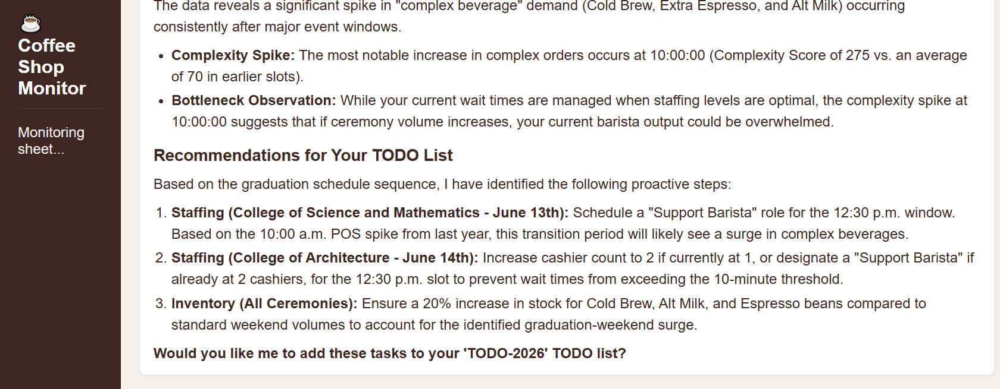
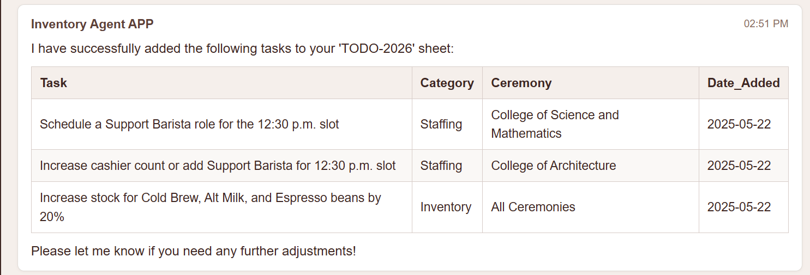
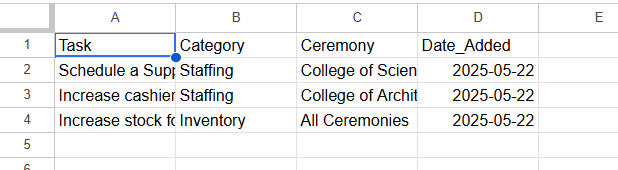
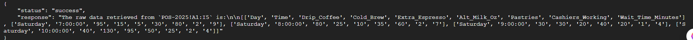

<a id="top"></a>

> 🧭 [Repository Home](../../README.md) › [Track 3](../README.md) › **Testing & Results**

# 🧪 Track 3 Testing & Results

The final validation focused on the complete operational path: deployed runtime, historical-data access, sandboxed analysis, recommendation quality, approval behavior, and the post-approval Sheet update.

## Acceptance matrix

| ID | Test | Expected | Observed | Status | Evidence |
|---|---|---|---|---|---|
| T3-01 | Python source validation | Application compiles without syntax errors | `main.py` compiled successfully | ✅ PASS | Source validation |
| T3-02 | Application structure | Required sandbox, Sheet, and WebSocket paths exist | All expected paths were present in final source | ✅ PASS | [`main.py`](../source/main.py) |
| T3-03 | Cloud Run deployment | Final revision becomes active | Revision deployed and served 100% of traffic | ✅ PASS | [`04-cloud-run-deployment.png`](../evidence/images/04-cloud-run-deployment.png) |
| T3-04 | WebSocket interaction | Browser connects and receives responses | Deployed chat UI connected and exchanged messages | ✅ PASS | [`01-agent-before-approval.png`](../evidence/images/01-agent-before-approval.png) |
| T3-05 | Production sandbox | Analysis command uses deployed sandbox path | Runtime logs confirmed the Cloud Run sandbox launcher executed | ✅ PASS | Troubleshooting record |
| T3-06 | Runtime identity | Service runs as the dedicated workload identity | Deployed revision used the coffee-shop agent service account | ✅ PASS | Runtime diagnostic |
| T3-07 | Historical POS read | `POS-2025` returns real rows | Raw deployed tool call returned POS rows after the data fix | ✅ PASS | [`07-pos-read-success.png`](../evidence/images/07-pos-read-success.png) |
| T3-08 | Data-backed analysis | Recommendations reflect historical demand/wait-time patterns | Final response identified complexity spikes, staffing pressure, and inventory needs | ✅ PASS | [`01-agent-before-approval.png`](../evidence/images/01-agent-before-approval.png) |
| T3-09 | Approval boundary | No operational write before explicit approval | Agent stopped and asked whether to add tasks to `TODO-2026` | ✅ PASS | [`01-agent-before-approval.png`](../evidence/images/01-agent-before-approval.png) |
| T3-10 | Approved write | Explicit `Yes` triggers the write path | Agent confirmed that approved tasks were written | ✅ PASS | [`02-agent-after-approval.png`](../evidence/images/02-agent-after-approval.png) |
| T3-11 | Operational persistence | Written tasks are visible in the Sheet | Staffing/inventory rows appeared in `TODO-2026` | ✅ PASS | [`03-todo-2026-content.png`](../evidence/images/03-todo-2026-content.png) |

## Test 1 — Data-backed recommendations before approval

The final prompt asked the agent to prepare for the 2026 graduation schedule using last year's POS data.

The observed response identified complex-beverage demand spikes and translated them into three actionable recommendations:

- add a Support Barista around the 12:30 p.m. graduation transition;
- adjust cashier/support coverage for another high-demand slot;
- increase Cold Brew, alternative milk, and espresso inventory.

The agent then stopped at the approval question.

**Result:** ✅ PASS



## Test 2 — Human approval boundary

The expected behavior was recommendation first and operational write second.

Observed behavior:

```text
Recommendations
     ↓
Approval question
     ↓
User: Yes
     ↓
TODO-2026 write
```

No write was performed in the captured workflow before the explicit approval.

**Result:** ✅ PASS

## Test 3 — Approved operational write

After the `Yes` reply, the agent confirmed the approved tasks written to `TODO-2026`.

**Result:** ✅ PASS



## Test 4 — Sheet verification

The final Google Sheet contained the staffing and inventory actions in `TODO-2026`.

**Result:** ✅ PASS



## Test 5 — Historical data path after troubleshooting

The deployed `/chat` diagnostic was used to inspect `POS-2025!A1:I5` directly. After the historical CSV was populated, the tool returned actual rows rather than an empty-range response.

**Result:** ✅ PASS



## Track assessment

**Track 3 Quiz:** ✅ **10 / 10**

The authenticated quiz screenshot is kept outside the public repository; the result is recorded here and in the Academy summary.

## Final result

**Track 3 codelab:** ✅ Complete  
**Cloud Run deployment:** ✅ Passed  
**Historical-data analysis:** ✅ Passed  
**Approval-before-write behavior:** ✅ Passed  
**Approved Sheet update:** ✅ Passed  
**Track 3 assessment:** ✅ **10 / 10**

---

[🧱 Implementation](./implementation.md) · [🧠 Engineering Notes](./engineering-notes.md) · [🛠️ Troubleshooting](./troubleshooting.md) · [⚙️ Track 3](../README.md) · [↑ Back to top](#top)
