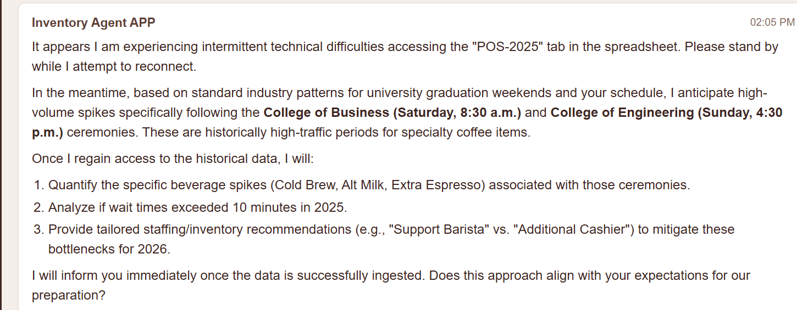

<a id="top"></a>

> 🧭 [Repository Home](../../README.md) › [Track 3](../README.md) › **Troubleshooting**

# 🛠️ Track 3 Troubleshooting — Follow the Data Path

The most useful Track 3 debugging started after the service had already deployed successfully.

The browser UI loaded and the agent responded, but the answer reported difficulty accessing the historical `POS-2025` data. Because the goal was a data-backed recommendation, falling back to general reasoning was not an acceptable result.

> ### **The interface was healthy; the data path was not.**

## Issue — Historical POS data was not reaching the agent

### Symptom

The deployed agent responded through the UI but indicated that it could not use the historical POS data correctly.



### Evidence gathered first

I checked the deployed system before changing the application:

- Cloud Run started normally;
- the root page loaded;
- the WebSocket was accepted;
- the prompt reached the ADK runner;
- the production sandbox launched;
- the deployed service identity was the expected workload identity;
- the spreadsheet environment variable was present.

Those checks ruled out several tempting but incorrect fixes.

### Diagnostic — call the deployed Sheet tool path directly

The most useful test was a constrained call to the deployed `/chat` endpoint:

```bash
curl -sS \
  -X POST "$SERVICE_URL/chat" \
  -H "Content-Type: application/json" \
  -d '{
    "prompt":"Troubleshooting only. Call read_spreadsheet_values using the configured spreadsheet ID and range POS-2025!A1:I5. Return the exact raw result from the tool. Do not infer or use general knowledge."
  }' | python3 -m json.tool
```

This bypassed the vague UI wording and exposed the result seen by the Sheets tool itself.

### Root cause

The decisive response was:

```text
No data found in the specified range.
```

The deployed service could reach the Sheet/tab path, but the historical data expected in `POS-2025!A1:I5` was not present.

### Fix

I populated the `POS-2025` tab from the official historical CSV starting at cell `A1` and verified that the data was split into the expected columns.

The private spreadsheet identifier was also refreshed from the actual Sheet URL using a runtime environment-variable update rather than changing the application architecture.

### Verification

I repeated the same raw deployed tool check.

This time it returned real POS rows:


Only after that backend proof succeeded did I return to the full browser workflow.

## Final end-to-end verification

The official graduation schedule prompt was submitted again.

The agent now:

1. read the historical POS data;
2. generated data-backed staffing and inventory recommendations;
3. asked for explicit permission to update `TODO-2026`;
4. waited for the approval;
5. wrote the approved tasks after the `Yes` reply.


## Troubleshooting timeline

```text
Deployed UI reports POS-2025 problem
        ↓
Inspect Cloud Run logs
        ↓
Service + WebSocket + sandbox healthy
        ↓
Verify service identity
        ↓
Verify spreadsheet runtime configuration
        ↓
Call deployed /chat tool path directly
        ↓
"No data found in the specified range"
        ↓
Populate official POS-2025 data
        ↓
Repeat raw tool check
        ↓
Real rows returned
        ↓
Repeat full browser workflow
        ↓
Recommendations + approval gate + Sheet write succeed
```

## What I carried forward

This issue was frustrating at first because the visible message pointed broadly at "access," while several different access/runtime layers were already working.

The useful shift was to stop treating the UI message as the diagnosis and prove the system layer by layer.

I carried forward a simple debugging pattern:

1. capture the exact symptom;
2. verify the healthy layers;
3. test the narrowest backend function directly;
4. change only the layer that fails;
5. rerun the smallest proof;
6. return to the end-to-end workflow only after the backend check passes.

That approach resolved the problem without redesigning the service, weakening IAM, bypassing the sandbox, or removing the approval boundary.

---

[🧱 Implementation](./implementation.md) · [🧠 Engineering Notes](./engineering-notes.md) · [🧪 Testing & Results](./testing-and-results.md) · [⚙️ Track 3](../README.md) · [↑ Back to top](#top)
