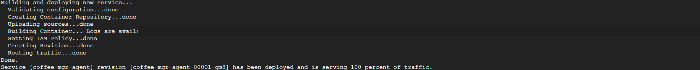

> 🧭 [Repository Home](../../README.md) › [Track 3](../README.md) › **Evidence**

# 🧾 Track 3 Evidence Index

## Completed build evidence

| File | What it proves |
|---|---|
| [`01-agent-before-approval.png`](./images/01-agent-before-approval.png) | The agent analyzed the historical data, presented operational recommendations, and stopped at the explicit approval question |
| [`02-agent-after-approval.png`](./images/02-agent-after-approval.png) | After approval, the agent confirmed the staffing/inventory tasks written to `TODO-2026` |
| [`03-todo-2026-content.png`](./images/03-todo-2026-content.png) | The approved operational rows are present in Google Sheets |
| [`04-cloud-run-deployment.png`](./images/04-cloud-run-deployment.png) | Final Cloud Run revision deployed successfully and served 100% of traffic |
| [`05-sheet-tabs.png`](./images/05-sheet-tabs.png) | The operational workbook contains both `POS-2025` and `TODO-2026` tabs |

## Troubleshooting evidence

| File | What it proves |
|---|---|
| [`06-initial-sheet-access-symptom.png`](./images/06-initial-sheet-access-symptom.png) | The first deployed interaction surfaced a historical-data problem |
| [`07-pos-read-success.png`](./images/07-pos-read-success.png) | The final raw tool check returned actual `POS-2025` rows after the data fix |

## Approval boundary

The agent completed the analysis and asked for approval before changing operational data.

## Approved action

The approved write was confirmed only after the explicit `Yes` reply.

## TODO-2026 verification

The staffing and inventory tasks were visible in the Google Sheet after approval.

## Cloud Run deployment

The public-safe crop preserves the successful revision/traffic proof without publishing the live endpoint or project identifier.

---

[🛠️ Troubleshooting](../docs/troubleshooting.md) · [🧪 Testing & Results](../docs/testing-and-results.md) · [⚙️ Track 3](../README.md) · [↑ Back to top](#top)
