 

 

**Three tracks. Three cloud builds. One security-first GenAI journey.**

Sonia Mansha · Personal learning portfolio

## 🎯 Why I Joined Cohort 3

I joined **Google Cloud Gen AI Academy APAC — Cohort 3** to move beyond simply using GenAI tools and understand how AI agents are **grounded, connected to data and tools, deployed, tested, and operated on cloud infrastructure**.

My background is in **Cloud Security, Cybersecurity, DevSecOps, and automation**, so I look at AI systems through two questions at once: **what can the agent do, and what should the system allow it to access?** I want intelligent applications with clear trust boundaries, controlled identities, protected credentials, and evidence that the system behaves as expected.

> ### **Build intelligent agents. Validate every layer. Secure by design.**

## 🚦 Academy at a Glance

| Milestone | Status | Focus |
|---|---|---|
| Cohort registration | ✅ Complete | Program participation |
| Workshops | ✅ **3 / 3 complete** | Track learning context |
| Mandatory Academy Quiz | ✅ **10 / 10** | Accelerate AI with Cloud Run APAC |
| Track 1 — RAG + ADK + Cloud Run | ✅ Complete | Customer-facing grounded agent |
| Track 1 Quiz | ✅ **10 / 10** | Customer-Facing AI Agent assessment |
| Track 1 — Firestore Vector Search | ✅ Complete | Vector-backed retrieval extension |
| Track 2 — Gemini + BigQuery MCP | ✅ Complete | Data-connected decision agent |
| Track 2 Quiz | ✅ **10 / 10** | Strategic Decisions assessment |
| Track 3 — Productivity Agent | ✅ Complete | Sandboxed operational agent |
| Track 3 Quiz | ✅ **10 / 10** | Daily Operations assessment |
| Track codelab submissions | ✅ **3 / 3 submitted** | Academy completion evidence |
| Meet the Builders | ✅ Submitted | Community milestone |
| Ideathon | 🔐 Separate repository | Secure Personal Gemini Journal |

## 🗂️ The Three Builds

<table>
<tr>
<td width="33%" valign="top">
<h3>☕ Track 1 — Grounded RAG Agent</h3>

<strong>Status:</strong> ✅ Complete

Built and deployed a customer-facing AI Barista grounded in menu data, validated its catalog and allergen boundaries, then extended retrieval with Firestore Vector Search.

<code>ADK</code> <code>Gemini</code> <code>RAG</code> <code>Streamlit</code> <code>Cloud Run</code> <code>Firestore</code>

<a href="./01-track-1-rag-adk-cloud-run/"><strong>Open Track 1 →</strong></a>

</td>
<td width="33%" valign="top">
<h3>📊 Track 2 — Data Agent</h3>

<strong>Status:</strong> ✅ Complete

Built and deployed a Gemini-powered ADK data agent that inspects NYC Citi Bike data through BigQuery MCP, executes read-only SQL, and turns the results into business recommendations.

<code>ADK</code> <code>Gemini</code> <code>BigQuery</code> <code>MCP</code> <code>Cloud Run</code>

<a href="./02-track-2-gemini-bigquery-mcp/"><strong>Open Track 2 →</strong></a>

</td>
<td width="33%" valign="top">
<h3>⚙️ Track 3 — Productivity Agent</h3>

<strong>Status:</strong> ✅ Complete

Built and deployed a coffee-shop productivity agent that reads historical POS data, performs sandboxed analysis, recommends staffing and inventory actions, and writes approved tasks to Google Sheets only after explicit human confirmation.

<code>ADK</code> <code>Gemini</code> <code>FastAPI</code> <code>WebSockets</code> <code>Cloud Run Sandbox</code> <code>Sheets</code>

<a href="./03-track-3-productivity-agent/"><strong>Open Track 3 →</strong></a>

</td>
</tr>
</table>

## 🏗️ Academy Architecture

## 🛡️ My Security-First Engineering Lens

**Security changes how I approach each build.**

| Engineering question | How I apply it |
|---|---|
| **What identity is the workload using?** | Prefer dedicated service identities and avoid broader access than the runtime needs. |
| **What data can the agent reach?** | Treat tool and data connections as explicit trust boundaries. |
| **Can the model change data?** | Separate analysis from mutation and make high-impact actions deliberate and reviewable. |
| **Where do secrets live?** | Keep credentials and private runtime configuration out of source control. |
| **How do I know it worked?** | Validate behavior with positive, negative, deployment, tool, and operational tests. |

Track 1 made **grounding and workload identity** concrete. Track 2 added **ADC-authenticated read-only analytical tools** and schema-first data reasoning. Track 3 introduced **sandboxed execution, separate read/write capabilities, and a human approval gate before operational changes**.

## 🧠 What the Three Tracks Changed for Me

| Track | Core lesson |
|---|---|
| **Track 1** | A useful agent needs a controlled source of truth. |
| **Track 2** | A data agent should inspect and use bounded tools instead of guessing. |
| **Track 3** | An agent that can act needs stronger control boundaries than an agent that only answers. |

Across the three tracks, the agent progressed from **retrieving**, to **reasoning**, to **acting**. My security perspective progressed with it—from controlling information access, to constraining tool access, to requiring human authorization before operational change.

> ### **Ground the knowledge. Query the data. Control the action.**

## 🔁 Engineering Workflow

```mermaid
%%{init: {"theme":"base","themeVariables":{"fontSize":"23px"},"flowchart":{"curve":"basis","nodeSpacing":45,"rankSpacing":45}}}%%

flowchart TB

    %% =====================================================
    %% TOP ROW — BUILD LIFECYCLE
    %% =====================================================
    subgraph ROW1[" "]
        direction LR

        A["🧭 01 · Understand"]
        B["🏗️ 02 · Build"]
        C["🧪 03 · Test"]
        D["🚀 04 · Deploy"]

        A ==> B ==> C ==> D
    end


    %% =====================================================
    %% BOTTOM ROW — ASSURE + IMPROVE
    %% =====================================================
    subgraph ROW2[" "]
        direction LR

        E["✅ 05 · Validate"]
        F["🔐 06 · Secure"]
        G["📝 07 · Document"]
        H["📈 08 · Improve"]

        E ==> F ==> G ==> H
    end


    %% Keep both horizontal rows
    ROW1 ==> ROW2


    %% =====================================================
    %% PREMIUM COLOR PALETTE
    %% =====================================================
    classDef understand fill:#172554,stroke:#38BDF8,stroke-width:4px,color:#F8FAFC,font-size:23px,font-weight:bold;
    classDef build fill:#083344,stroke:#22D3EE,stroke-width:4px,color:#F8FAFC,font-size:23px,font-weight:bold;
    classDef test fill:#312E81,stroke:#818CF8,stroke-width:4px,color:#F8FAFC,font-size:23px,font-weight:bold;
    classDef deploy fill:#581C87,stroke:#D946EF,stroke-width:4px,color:#F8FAFC,font-size:23px,font-weight:bold;

    classDef validate fill:#14532D,stroke:#4ADE80,stroke-width:4px,color:#F8FAFC,font-size:23px,font-weight:bold;
    classDef secure fill:#134E4A,stroke:#2DD4BF,stroke-width:4px,color:#F8FAFC,font-size:23px,font-weight:bold;
    classDef document fill:#713F12,stroke:#FBBF24,stroke-width:4px,color:#F8FAFC,font-size:23px,font-weight:bold;
    classDef improve fill:#7C2D12,stroke:#FB923C,stroke-width:4px,color:#F8FAFC,font-size:23px,font-weight:bold;


    %% =====================================================
    %% APPLY COLORS
    %% =====================================================
    class A understand;
    class B build;
    class C test;
    class D deploy;

    class E validate;
    class F secure;
    class G document;
    class H improve;


    %% =====================================================
    %% CLEAN ROWS
    %% =====================================================
    style ROW1 fill:none,stroke:none
    style ROW2 fill:none,stroke:none


    %% =====================================================
    %% PREMIUM CONNECTORS
    %% =====================================================
    linkStyle default stroke:#CBD5E1,stroke-width:4px;
```

> **Architecture → Implementation → Validation → Evidence → Lessons**

## 🧾 Evidence Highlights

<table>
<tr>
<td width="33%" valign="top">
<strong>Track 1 — Vector-backed retrieval</strong>  

 <em>A product added directly to Firestore became visible and retrievable through the vector-backed agent.</em>
</td>
<td width="33%" valign="top">
<strong>Track 2 — Data-backed decision</strong>  

 <em>The deployed data agent returned three Citi Bike locations backed by read-only BigQuery analysis.</em>
</td>
<td width="33%" valign="top">
<strong>Track 3 — Approval before action</strong>  

 <em>The productivity agent completed its analysis and stopped for explicit approval before writing to the operational Sheet.</em>
</td>
</tr>
</table>

[Open Track 1 →](./01-track-1-rag-adk-cloud-run/) · [Open Track 2 →](./02-track-2-gemini-bigquery-mcp/) · [Open Track 3 →](./03-track-3-productivity-agent/)

## 🧭 Repository Map

| Area | What you will find |
|---|---|
| [`00-academy-overview/`](./00-academy-overview/) | Final Academy scope, completion summary, official track links, and Ideathon boundary |
| [`01-track-1-rag-adk-cloud-run/`](./01-track-1-rag-adk-cloud-run/) | Completed Track 1 case study, source, implementation, tests, evidence, and engineering notes |
| [`02-track-2-gemini-bigquery-mcp/`](./02-track-2-gemini-bigquery-mcp/) | Completed Track 2 data-agent case study, source, tests, evidence, troubleshooting, and engineering notes |
| [`03-track-3-productivity-agent/`](./03-track-3-productivity-agent/) | Completed Track 3 productivity-agent case study, source, data, tests, evidence, troubleshooting, and engineering notes |
| [`ATTRIBUTION.md`](./ATTRIBUTION.md) | Official codelab sources and attribution |
| [`assets/`](./assets/) | Academy architecture and social-preview artwork |

## 🧠 Engineering Areas Demonstrated

| Area | Hands-on evidence |
|---|---|
| 🤖 **AI Agent Engineering** | ADK `LlmAgent`, Gemini configuration, tools, system instructions, sessions, and deployed agent workflows across all three tracks |
| 🧩 **Grounding & RAG** | Menu-only recommendations, negative catalog testing, embeddings, and Firestore Vector Search in Track 1 |
| 📊 **BigQuery Data Analysis** | Citi Bike schema inspection, read-only SQL, MCP tool traces, and business recommendations in Track 2 |
| 🔌 **Model Context Protocol** | Managed BigQuery MCP with bounded table/schema/read-only SQL tools |
| 🛡️ **Sandboxed Execution** | Cloud Run Sandbox-compatible Python/shell analysis in Track 3 |
| 📄 **Operational Data Integration** | Google Sheets reads plus approved `TODO-2026` writes in Track 3 |
| ⚖️ **Human Approval Controls** | Recommendations separated from operational mutation before an explicit approval event in Track 3 |
| 🔐 **Identity & Tool Boundaries** | Dedicated workload identities, ADC-authenticated tools, runtime configuration, read/write separation, and no embedded service-account key files |
| ☁️ **Cloud-Native Deployment** | Cloud Run deployments for all three completed agent builds |
| 🌐 **Application Interfaces** | Streamlit in Track 1, ADK Web in Track 2, and FastAPI + WebSockets in Track 3 |
| 🛠️ **Runtime Troubleshooting** | Cloud Run logs, streaming/model isolation, data-path diagnosis, direct backend probes, and controlled fixes |
| 🧪 **Validation** | Grounding/negative tests, MCP/tool traces, deployment proof, approval gating, backend data checks, and operational write verification |

## 🌐 Community & Next Phase

**Meet the Builders:** ✅ Submitted  
[View my Cohort 3 LinkedIn update](https://lnkd.in/p/g43pkrGc)

The three Academy tracks, their workshops, assessments, and codelab submissions are complete. The next phase is the Cohort 3 Ideathon — **Secure Personal Gemini Journal** — which continues in a separate repository.

## 👩‍💻 About Me

I am **Sonia Mansha**, building at the intersection of **Cloud Security, DevSecOps, and Generative AI**. I am especially interested in AI agents that are useful to people while keeping identity, data access, credentials, and operational actions explicit and controlled.

- GitHub: https://github.com/sonia11mansha415
- LinkedIn: https://www.linkedin.com/in/sonia11mansha415

### **From codelab to cloud — understand it, build it, prove it.**

Google Cloud Gen AI Academy APAC · Cohort 3 · Sonia Mansha

  

[Back to top](#top)

