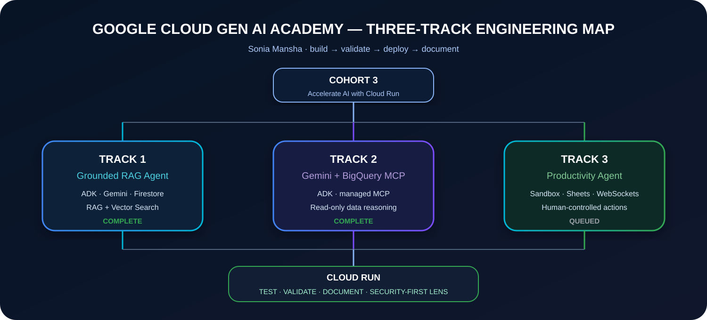

 

 

**Three tracks. Three cloud builds. One security-first GenAI journey.**

Personal learning portfolio by <strong>Sonia Mansha</strong> · Not an official Google Cloud repository

## 🎯 Why I Joined Cohort 3

I joined **Google Cloud Gen AI Academy APAC — Cohort 3** because I wanted to move beyond simply using GenAI tools and understand how AI agents are actually **grounded, connected to data and tools, deployed, tested, and operated on cloud infrastructure**.

My background is in **Cloud Security, Cybersecurity, DevSecOps, and automation**, so I naturally look at AI systems through two lenses at the same time: **what the agent can do** and **what the system should be allowed to access**. I want intelligent applications, but I also want explicit trust boundaries, controlled identities, protected credentials, and evidence that the system behaves as expected.

> ### **Build intelligent agents. Validate every layer. Secure by design.**

## 🚦 Academy at a Glance

| Milestone | Current state | Portfolio boundary |
|---|---|---|
| Cohort registration | ✅ Complete | Program participation |
| Workshops | ✅ 3 / 3 complete | Track learning context |
| Track 1 — RAG + ADK + Cloud Run | 🟡 In progress | Active implementation workspace |
| Track 2 — Gemini + BigQuery MCP | ⏳ Queued | Document only after execution begins |
| Track 3 — Productivity Agent | ⏳ Queued | Document only after execution begins |
| Mandatory Academy assessment | ⏳ Pending | Completion status only |
| Track MCQs | ⏳ Pending | Completion status only |
| Meet the Builders | ✅ Submitted | Public cohort update only |
| Ideathon | 🔐 Separate repository | Secure Personal Gemini Journal will be judge-focused and independent |

## 🗂️ The Three Builds

<table>
<tr>
<td width="33%" valign="top">
<h3>☕ Track 1 — Grounded RAG Agent</h3>

<strong>Status:</strong> 🟡 In progress

Build a customer-facing AI Barista using Google ADK and Gemini, ground its recommendations in a controlled menu source, wrap it in Streamlit, and deploy it to Cloud Run.

<code>ADK</code> <code>Gemini</code> <code>RAG</code> <code>Streamlit</code> <code>Cloud Run</code>

<a href="./01-track-1-rag-adk-cloud-run/"><strong>Open Track 1 →</strong></a>

</td>
<td width="33%" valign="top">
<h3>📊 Track 2 — Data Agent</h3>

<strong>Status:</strong> ⏳ Queued

Connect a Gemini-powered ADK agent to BigQuery through the managed MCP server so the agent can inspect structured data, formulate SQL, and reason from verified query results.

<code>ADK</code> <code>Gemini</code> <code>BigQuery</code> <code>MCP</code> <code>Cloud Run</code>

<a href="./02-track-2-gemini-bigquery-mcp/"><strong>Open Track 2 →</strong></a>

</td>
<td width="33%" valign="top">
<h3>⚙️ Track 3 — Productivity Agent</h3>

<strong>Status:</strong> ⏳ Queued

Build a personal operations assistant that analyzes business data, executes code in a sandboxed environment, and requests explicit human approval before changing operational data.

<code>ADK</code> <code>Cloud Run</code> <code>Sandboxes</code> <code>Sheets</code> <code>WebSockets</code>

<a href="./03-track-3-productivity-agent/"><strong>Open Track 3 →</strong></a>

</td>
</tr>
</table>

## 🏗️ Academy Architecture

## 🛡️ My Security-First Engineering Lens

Security is something... that changes how I interpret each build.

| Engineering question | How I apply it |
|---|---|
| **What identity is the workload using?** | Prefer dedicated service identities and avoid giving a runtime broader access than it needs. |
| **What data can the agent reach?** | Treat tool and data connections as explicit trust boundaries rather than invisible model capabilities. |
| **Can the model change data?** | Prefer read-only tools where the use case only needs analysis; keep operational changes deliberate and reviewable. |
| **Where do secrets live?** | Never commit credentials, API keys, service-account keys, or private environment files. |
| **How do I know it worked?** | Preserve sanitized tests, deployment evidence, and failure/recovery notes instead of relying on a success message alone. |
| **What should remain private?** | Keep participant dashboards, quiz content, billing material, internal IDs, and private user data outside the public repository. |

## 🔁 Engineering Workflow

```mermaid
flowchart LR
    A[Understand] --> B[Build]
    B --> C[Test]
    C --> D[Deploy]
    D --> E[Validate]
    E --> F[Secure]
    F --> G[Document]
    G --> H[Improve]

    classDef start fill:#0B57D0,stroke:#8AB4F8,color:#fff,stroke-width:2px;
    classDef build fill:#063970,stroke:#00B8D9,color:#fff,stroke-width:2px;
    classDef validate fill:#1B5E20,stroke:#34A853,color:#fff,stroke-width:2px;
    classDef secure fill:#311B92,stroke:#7C4DFF,color:#fff,stroke-width:2px;
    class A start;
    class B,C,D build;
    class E,G,H validate;
    class F secure;
```

My documentation rule is equally simple:

> **Architecture → Implementation → Validation → Evidence → Lessons**

## 🧾 Evidence Standard

I keep evidence curated. A public screenshot should answer a technical question.

For each completed track, the strongest evidence will normally show:

1. the deployed application or agent;
2. a meaningful functional test;
3. the Cloud Run deployment result;
4. the agent-to-data/tool behavior that defines the track;
5. one security or operational control worth highlighting.

## 🧭 Repository Map

| Area | What you will find |
|---|---|
| [`00-academy-overview/`](./00-academy-overview/) | Cohort scope, completion model, official sources, public milestones, and documentation rules |
| [`01-track-1-rag-adk-cloud-run/`](./01-track-1-rag-adk-cloud-run/) | Active RAG/ADK/Streamlit/Cloud Run implementation, engineering notes, testing plan, and evidence index |
| [`02-track-2-gemini-bigquery-mcp/`](./02-track-2-gemini-bigquery-mcp/) | Queued Gemini + BigQuery MCP data-agent workspace |
| [`03-track-3-productivity-agent/`](./03-track-3-productivity-agent/) | Queued productivity-agent workspace with sandboxed execution and human-controlled actions |
| [`ATTRIBUTION.md`](./ATTRIBUTION.md) | Official codelab sources, portfolio boundaries, and source-integrity/licensing notes |
| [`assets/`](./assets/) | Repository-owned visual assets and social-preview artwork |

## 🧠 Engineering Areas Demonstrated

| Area | Hands-on focus across the Academy |
|---|---|
| 🤖 **AI Agent Engineering** | ADK agents, model instructions, tools, agent state, deployment-oriented application structure |
| 🧩 **Grounding & RAG** | Constraining recommendations to controlled source data and testing out-of-source behavior |
| 📊 **Data-Connected Agents** | BigQuery, MCP, schema inspection, read-only SQL execution, evidence-based reasoning |
| ☁️ **Cloud-Native Deployment** | Cloud Run, source/container deployment, service identities, environment configuration |
| ⚙️ **Operational Agents** | Sandboxed code execution, business-data analysis, human approval before mutations |
| 🔐 **Security & DevSecOps Thinking** | Least privilege, secret hygiene, evidence sanitization, access boundaries, safe operational controls |
| 🧪 **Validation** | Positive/negative functional tests, grounding checks, deployment verification, result documentation |
| 📝 **Technical Documentation** | Architecture, implementation notes, testing, evidence, limitations, lessons, reproducibility |

## 🌱 What I Am Building Toward

The Academy is one stage in a larger direction for me: **secure GenAI application and AI-agent engineering**.

My existing cloud-security background taught me to think about identity, data boundaries, resilience, and evidence. Cohort 3 adds another layer: models, tools, grounding, agent workflows, managed AI services, and serverless deployment.

The next challenge is the Cohort 3 Ideathon, where I will build the **Secure Personal Gemini Journal** in a separate public repository so the judge-facing project can stay focused on its own requirements, security architecture, tests, source code, and demo evidence.

## 🌐 Cohort Update

I also completed the **Meet the Builders** submission and shared my Cohort 3 / Ideathon direction publicly:

**LinkedIn:** https://lnkd.in/p/g43pkrGc

## 👩‍💻 About Me

**Sonia Mansha**  
Cloud Security · Cybersecurity · DevSecOps · Automation · Secure GenAI

- GitHub: https://github.com/sonia11mansha415
- LinkedIn: https://www.linkedin.com/in/sonia11mansha415

### **From codelab to cloud — understand it, build it, prove it.**

Google Cloud Gen AI Academy APAC · Cohort 3 · Personal learning portfolio of Sonia Mansha

  

[Back to top](#top)

